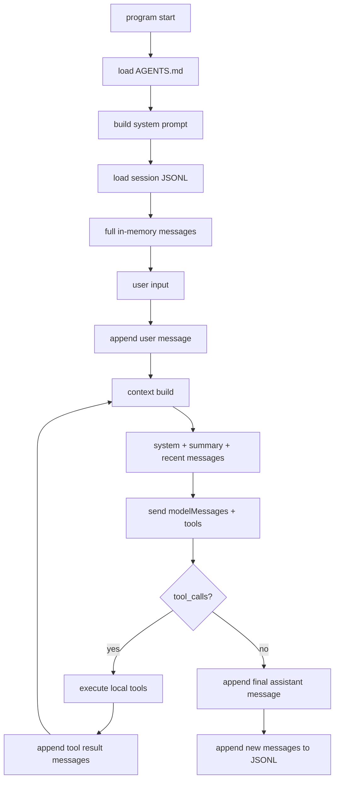
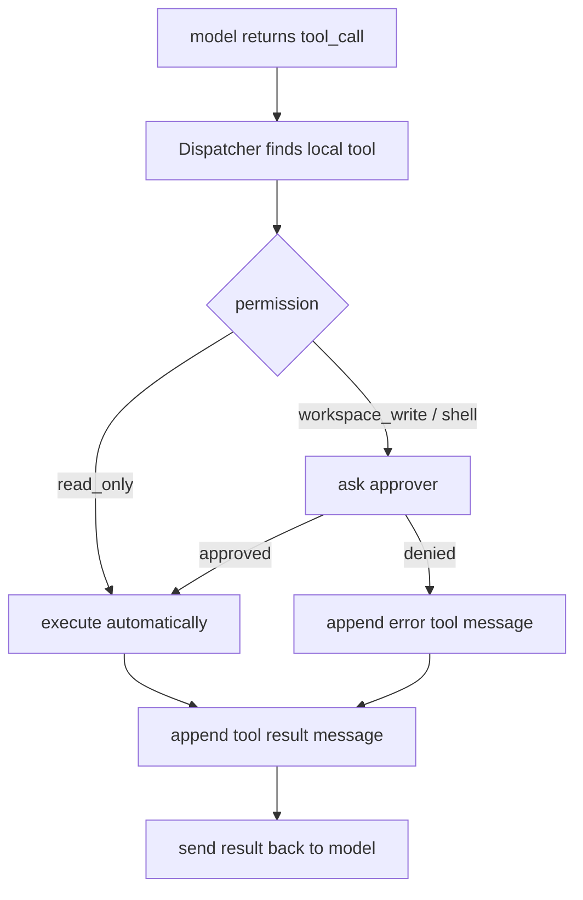
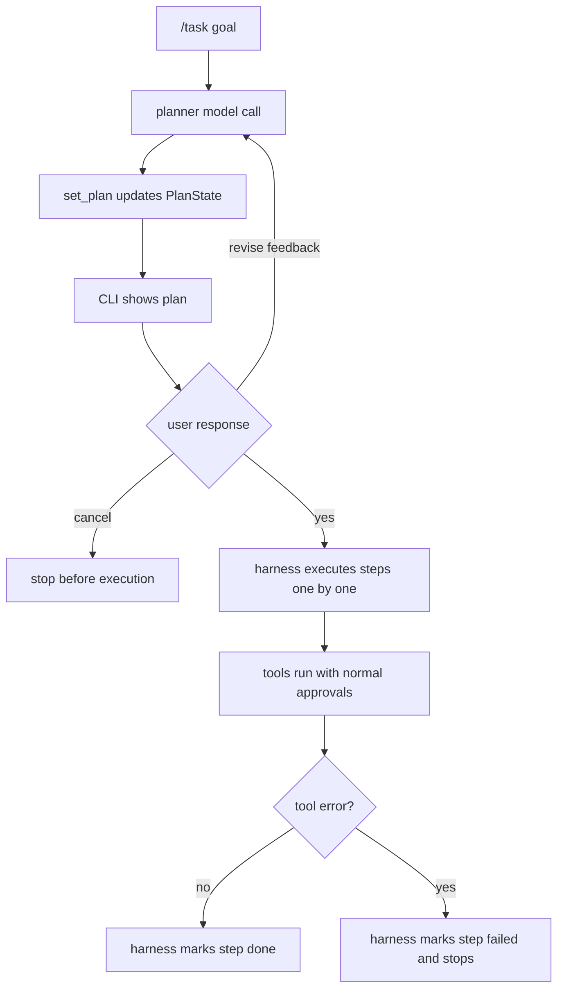

# MiniAgent

MiniAgent is a small Go learning project for building a minimal command-line agent harness.

It demonstrates the core pieces of a coding agent:

- OpenAI-compatible chat completion
- tool calling
- an agent loop
- local read-only tools
- JSONL session persistence
- multiple sessions
- `AGENTS.md` project instructions
- recent-message context trimming
- debug output for raw API request/response JSON
- minimal `SKILL.md` loading for planner instructions
- allowlisted skill script execution behind approval

The code intentionally stays compact and standard-library first so each layer is easy to inspect while learning.

## Learning Path

For the current full-flow summary, read:

- `docs/agent-harness-full-flow.md`
- `docs/agent-core-roadmap.md`
- `docs/v3-plan.md`

Recommended study order:

```text
1. messages / sessions / context
2. tool calling
3. agent loop
4. permissions / approval / preflight
5. planner
6. skills
7. manifest local policy
8. script execution audit logs
```

## Branch Roadmap

`main` contains the completed MiniAgent v1 learning harness.

`MiniAgent_V2` contains the completed agent-core pass: planner, executor,
tool permissions, context summaries, skill routing, local manifests, and
allowlisted skill script execution.

`MiniAgent_V3` is the branch for the next stage after the v2 agent-core pass.
The v3 work focuses on the advanced layers behind real coding agents:

- lightweight project context and indexing
- project-aware planner/executor context
- MCP concepts and a minimal adapter
- external file/resource permission boundaries
- long-term memory and retrieval-augmented context
- multi-agent role orchestration

Read `docs/v3-plan.md` before starting v3 changes. It explains the current
command flows and the recommended learning order for this branch.

## Quick Start

Set an API key for an OpenAI-compatible provider:

```bash
export ZAI_API_KEY="your-api-key"
```

Optional provider settings:

```bash
export ZAI_BASE_URL="https://open.bigmodel.cn/api/paas/v4"
export ZAI_MODEL="glm-4.6v"
```

DeepSeek-compatible settings are also supported:

```bash
export DEEPSEEK_API_KEY="your-api-key"
export DEEPSEEK_BASE_URL="https://api.deepseek.com"
export DEEPSEEK_MODEL="deepseek-v4-flash"
export DEEPSEEK_ENABLE_THINKING=false
```

`DEEPSEEK_ENABLE_THINKING=false` is DeepSeek-specific. MiniAgent sends it as
`"enable_thinking": false` in the request body so models that require
`reasoning_content` in thinking mode can run in non-thinking mode. Other
providers do not read this variable.

Run one prompt:

```bash
go run ./cmd/miniagent "hello"
```

Run interactive mode:

```bash
go run ./cmd/miniagent
```

## Interactive Commands

Inside interactive mode:

```text
/help
/chat <message>
/task <goal>
/plan
/summary
/skill-route <task>
/skill-load <task>
/skill-scripts <skill>
/skill-manifest <skill>
/skills
/skill <name>
/logs
/history
/debug-api
/clear
/session
/session list
/session use <id>
/session new <id>
/exit
```

Core commands:

```text
/chat <message>        Plain streaming chat without tools.
/task <goal>           Plan first, ask for approval, then execute steps.
/plan                  Show the current in-memory task plan.
/summary               Show the current session's rolling summary.
/history               Show the current session message history.
/debug-api             Toggle raw API request/response printing.
/clear                 Clear the current session.
/exit                  Exit interactive mode.
```

Skill commands:

```text
/skills                List local skills from skills/*/SKILL.md.
/skill <name>          Show one skill's metadata and prompt preview.
/skill-route <task>    Send only name + description catalog and select a skill.
/skill-load <task>     Route, load selected SKILL.md, and dry-run guidance.
/skill-scripts <skill> List files under one skill's scripts/ directory.
/skill-manifest <skill>
                       Show local script execution policy.
```

`/skill-route <task>` sends only the skill catalog (`name + description`) to a
router model and prints the selected skill. It does not inject skill bodies or
execute skill scripts.

`/skill-load <task>` first routes the task, then loads only the selected
`SKILL.md` body into a dry-run model call. It exposes no tools and executes no
scripts.

`/task <goal>` also uses skill routing automatically. It first sends only the
skill catalog (`name + description`) to the router. If a relevant skill is
selected, MiniAgent loads only that one `SKILL.md` body into the planner and
executor prompts. This keeps context small while still giving the agent
task-specific guidance.

`/skill-scripts <skill>` lists files under one skill's `scripts/` directory.
It does not execute them.

`/skill-manifest <skill>` shows the local `manifest.local.json` script
execution policy for one skill. It does not execute scripts.

`run_skill_script` is a guarded tool, not a free-form script runner. It
reads script permissions from each skill's `manifest.local.json`, requires
explicit approval after preflight validation, runs with a timeout, and truncates
stdout/stderr. The demo manifest includes a direct shell-script demo and a
`python3` runner demo.

Manifests can also document reviewed-but-denied scripts with `allowed: false`
and a `reason`, which is useful for third-party skills that need more review
before execution.

Session and log commands:

```text
/session               Show current session.
/session list          List saved sessions.
/session use <id>      Switch to a session, creating it if needed.
/session new <id>      Create and switch to a new empty session.
/logs                  Show recent structured JSONL events for current session.
```

Useful `/logs` forms:

```text
/logs
/logs all
/logs session default
/logs type tool_result
/logs type skill_script_preflight
/logs type skill_script_execute
/logs errors
/logs all errors tail 50
```

## Environment Variables

Model/provider:

```text
ZAI_API_KEY
ZAI_BASE_URL
ZAI_MODEL
```

Fallback API variables are also supported:

```text
DEEPSEEK_API_KEY / DEEPSEEK_BASE_URL / DEEPSEEK_MODEL
ZHIPUAI_API_KEY / ZHIPUAI_BASE_URL / ZHIPUAI_MODEL
GLM_API_KEY / GLM_BASE_URL / GLM_MODEL
OPENAI_API_KEY / OPENAI_BASE_URL / OPENAI_MODEL
MINIAGENT_API_KEY / MINIAGENT_BASE_URL / MINIAGENT_MODEL
```

Runtime:

```text
MINIAGENT_SESSION=study
MINIAGENT_DEBUG_API=1
MINIAGENT_CONTEXT_MESSAGES=20
MINIAGENT_SUMMARY_TRIGGER_MESSAGES=40
MINIAGENT_SUMMARY_KEEP_MESSAGES=20
MINIAGENT_SUMMARY_BATCH_MESSAGES=5
MINIAGENT_SUMMARY_MAX_CHARS=3000
MINIAGENT_SUMMARY_TIMEOUT_SECONDS=20
MINIAGENT_SUMMARY_MODEL=glm-4.6v
```

DeepSeek-specific:

```text
DEEPSEEK_ENABLE_THINKING=false
DEEPSEEK_REASONING_EFFORT=none
```

`DEEPSEEK_ENABLE_THINKING=false` is the fast path for disabling thinking mode.
`DEEPSEEK_REASONING_EFFORT` is optional and only sent when explicitly set.

`MINIAGENT_CONTEXT_MESSAGES` controls how many recent non-system messages are
sent to the model as raw history.

`MINIAGENT_SUMMARY_TRIGGER_MESSAGES` controls when rolling summary compression
starts. Once the non-system history is longer than this value, MiniAgent
compresses older messages into `sessions/summaries/<session>.md`.

`MINIAGENT_SUMMARY_KEEP_MESSAGES` controls how many newest messages are left
uncompressed when updating the summary.

`MINIAGENT_SUMMARY_BATCH_MESSAGES` controls how many not-yet-summarized older
messages must accumulate before MiniAgent calls the summary model. This avoids
summarizing again for every single message that slides out of the recent window.

`MINIAGENT_SUMMARY_MAX_CHARS` is the summary size budget. MiniAgent asks the
summary model to stay under this character limit and also truncates oversized
summary output.

`MINIAGENT_SUMMARY_TIMEOUT_SECONDS` limits how long a summary update may wait.
If summary generation fails or times out, MiniAgent logs the failure and keeps
running with the previous summary plus recent raw messages.

`MINIAGENT_SUMMARY_MODEL` optionally selects a separate model for context
summary updates. If it is not set, MiniAgent reuses the main chat model.

Optional summary-provider overrides:

```text
MINIAGENT_SUMMARY_BASE_URL=...
MINIAGENT_SUMMARY_API_KEY_ENV=ZAI_API_KEY
```

The full session is still kept in memory and persisted to disk. Summary
compression only changes what is sent to the model for a single request.

Runtime logs are written to:

```text
logs/miniagent.jsonl
```

## Tools

MiniAgent currently exposes local tools to the model:

```text
get_time
list_files
read_file
grep_text
write_file
edit_file
run_shell
run_skill_script
set_plan
```

The model sees only each tool's schema and description. The Go program decides whether the requested tool exists, executes it locally, then feeds the result back as a `role=tool` message.

Examples:

```text
现在几点？
递归列出当前项目文件，最多 20 个
读取 README.md
搜索 generaterequest，不区分大小写，最多 10 个
```

The read tools are constrained to the workspace. `write_file` and `edit_file`
can change workspace files, so they declare `workspace_write`. `run_shell` can
execute a small allowlist of verification commands, so it declares `shell`.
`run_skill_script` can execute locally authorized skill scripts, so it also
declares `shell`. Write and shell tools require explicit approval before
execution.
Plan tools only change MiniAgent's in-memory harness state.

Tool failures use a structured recovery format:

```json
{
  "ok": false,
  "error_type": "not_found",
  "message": "old_text not found in file: notes.txt",
  "recoverable": true,
  "suggested_next_step": "Use read_file to inspect the file, then retry edit_file with exact old_text."
}
```

MiniAgent sends this JSON back as a `role=tool` message so the model can decide
whether to inspect, retry with corrected arguments, or stop and explain.

## Project Structure

```text
cmd/miniagent/          CLI entry point and current orchestration glue
internal/llm/           provider-neutral message types and OpenAI-compatible client
internal/agent/         tool dispatcher and agent struct skeleton
internal/tools/         local tool interface and tool implementations
internal/session/       JSONL session store
internal/contextx/      context trimming and rolling summaries
internal/project/       AGENTS.md discovery
internal/prompt/        system prompt construction
docs/                   learning notes
sessions/               JSONL session files
AGENTS.md               project-level instructions loaded into the system prompt
```

## Runtime Flow



The important separation is:

```text
full messages   = complete session history for /history and JSONL persistence
summary         = compressed older context in sessions/summaries/<session>.md
modelMessages   = system + summary + recent raw messages sent for one request
```

## Tool Permissions

The model can request a tool call, but MiniAgent owns the execution boundary.



Current read tools are `read_only`. `write_file` and `edit_file` use
`workspace_write`; `run_shell` uses `shell`. Both non-read permissions require
explicit approval before execution.

## Task Planning

`/task <goal>` runs a plan-first workflow:



`/plan` only displays the current `PlanState`; it does not execute anything.

## Structured Logs

MiniAgent writes local JSONL events for observing harness behavior:

```text
model_turn
chat_stream
tool_call
tool_result
approval_requested
approval_result
plan_generated
plan_approved
plan_revised
plan_cancelled
plan_step
```

These logs are separate from `/history`. History is conversation context;
structured logs are execution/audit events for debugging the harness.

MiniAgent keeps one global log stream and filters by event fields:

```text
logs/miniagent.jsonl
```

Each event carries a `session` field, so `/logs` can show current-session
events while `/logs all` can show the cross-session timeline.

## Learning Notes

Current notes:

- `docs/day03-context-and-session.md`
- `docs/day04-tool-permissions.md`
- `docs/day05-write-file.md`
- `docs/day06-edit-file.md`
- `docs/day07-run-shell.md`
- `docs/day08-task-plan.md`
- `docs/day09-structured-logs.md`
- `docs/day10-mini-harness.md`
- `docs/day11-skills-loader.md`
- `docs/agent-harness-full-flow.md`
- `docs/day11-context-summary.md`
- `docs/day12-tool-recovery.md`
- `docs/day13-skill-orchestration.md`

New v2 notes should be added under `docs/` as each v2 step lands.

## Tests

Run:

```bash
go test ./...
```

The tests cover:

- agent loop tool-result feedback
- context trimming behavior
- `AGENTS.md` discovery
- system prompt composition
- JSONL session store
- file tools
