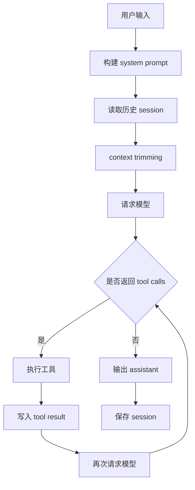

可以。下面直接给你一套 **Go 版 mini agent 学习与实践方案**，目标是让你用 Go 做出一个最小但完整的 agent harness。

**目标**
做出一个命令行 agent，具备这些能力：

- 调用大模型
- 支持流式输出
- 支持 tool calling
- 支持自动循环执行工具
- 保存 session
- 恢复历史
- 加载 `AGENTS.md`
- 做基础 context trimming

---

**一、10 天学习计划**

**第 1 天：最小聊天 CLI**
目标：完成一次最简单的模型调用。

做这些：

- 写 `main.go`
- 从环境变量读取 API key
- 发一个 `system + user` 请求
- 打印模型回复

要掌握：

- `net/http`
- `encoding/json`
- 基本请求结构体设计

产出：

- `cmd/miniagent/main.go`
- 可成功问答一次

---

**第 2 天：流式输出**
目标：做出边生成边打印。

做这些：

- 接 provider 的 streaming 接口
- 一边读响应一边输出
- 处理超时、EOF、半途中断

要掌握：

- `bufio.Reader`
- `context.Context`
- 流式 HTTP 响应处理

产出：

- `llm/stream.go`

---

**第 3 天：消息结构与 session 内存模型**
目标：先把消息对象定义对。

做这些：

- 设计消息类型
- 支持：
  - user
  - assistant
  - tool
  - system
- 在内存中维护 `[]Message`

建议结构：

```go
type Role string

const (
    RoleSystem    Role = "system"
    RoleUser      Role = "user"
    RoleAssistant Role = "assistant"
    RoleTool      Role = "tool"
)

type Message struct {
    Role       Role            `json:"role"`
    Content    string          `json:"content,omitempty"`
    ToolCalls  []ToolCall      `json:"tool_calls,omitempty"`
    ToolCallID string          `json:"tool_call_id,omitempty"`
    ToolName   string          `json:"tool_name,omitempty"`
}
```

要掌握：

- “session 是消息序列”这个概念
- tool result 本质也是消息

---

**第 4 天：第一个工具**
目标：让模型能调用一个工具。

建议先做：

- `get_time`

做这些：

- 定义 tool schema
- 检测模型返回的 tool call
- 执行本地工具函数
- 把结果作为 tool message 回灌

要掌握：

- tool call 生命周期
- 模型输出“意图”，程序负责执行

产出：

- `tools/time.go`
- `agent/tool_dispatch.go`

---

**第 5 天：最小 agent loop**
目标：真正变成 agent，而不是一次性问答。

做这些：

- 用户发一条消息
- 调模型
- 如果有 tool call，执行工具
- 追加 tool result
- 再次请求模型
- 直到没有 tool call 为止

这是最核心的一天。

建议主循环长这样：

```go
for {
    resp, err := model.Generate(ctx, messages, tools)
    if err != nil { ... }

    messages = append(messages, resp.AssistantMessage)

    if len(resp.ToolCalls) == 0 {
        break
    }

    for _, call := range resp.ToolCalls {
        result, err := dispatcher.Execute(ctx, call)
        ...
        messages = append(messages, ToolResultMessage(call, result))
    }
}
```

要掌握：

- 一个用户请求可能触发多轮模型调用
- tool result 要回到上下文里

---

**第 6 天：做 3 个有用工具**
目标：把玩具工具升级成 coding agent 基础工具。

建议做：

- `read_file`
- `list_files`
- `grep_text`

可选第 4 个：

- `run_shell`

注意先别急着上危险 shell，前期建议先上只读工具。

工具接口建议：

```go
type Tool interface {
    Name() string
    Description() string
    Schema() ToolSchema
    Execute(ctx context.Context, input json.RawMessage) (ToolResult, error)
}
```

---

**第 7 天：session 持久化**
目标：能恢复历史。

做这些：

- 用 JSONL 保存每条消息
- 每轮 user / assistant / tool result 都写一条
- 启动时加载 session 文件

建议目录：

- `sessions/<session-id>.jsonl`

建议 entry：

```go
type SessionEntry struct {
    Timestamp time.Time `json:"timestamp"`
    Message   Message   `json:"message"`
}
```

要掌握：

- session 不只是 UI 功能，而是 runtime 状态的一部分

---

**第 8 天：加载 `AGENTS.md`**
目标：引入项目级规则。

做这些：

- 从当前目录向上查找 `AGENTS.md`
- 读取内容
- 拼进 system prompt
- 再请求模型

要掌握：

- 项目规则属于 prompt 装配层，不属于 session 历史
- 这是 coding agent 和普通聊天机器人的差异点

建议做法：

```go
systemPrompt = basePrompt + "\n\n# Project Instructions\n\n" + agentsMdContent
```

---

**第 9 天：context trimming**
目标：解决上下文无限增长。

先做最简单版本：

- 保留 system prompt
- 保留最近 N 条消息
- 工具结果太长时做截断

要掌握：

- context window 是硬约束
- 不控制长度，agent 很快变差

建议接口：

```go
type ContextManager interface {
    Build(messages []Message) []Message
}
```

第一版直接做 `RecentNContextManager` 就行。

---

**第 10 天：整理成 mini harness**
目标：把 demo 变成结构清晰的小项目。

整理出这些层：

- `cmd/`
- `internal/llm/`
- `internal/agent/`
- `internal/tools/`
- `internal/session/`
- `internal/contextx/`
- `internal/project/`

最终要求：

- 有 CLI
- 有 session
- 有 3 个工具
- 有 loop
- 有 AGENTS.md
- 有 trimming
- 有日志

---

**二、推荐目录结构**

```text
miniagent/
├── cmd/
│   └── miniagent/
│       └── main.go
├── internal/
│   ├── agent/
│   │   ├── agent.go
│   │   ├── loop.go
│   │   └── dispatcher.go
│   ├── llm/
│   │   ├── client.go
│   │   ├── openai.go
│   │   ├── stream.go
│   │   └── types.go
│   ├── tools/
│   │   ├── tool.go
│   │   ├── read_file.go
│   │   ├── list_files.go
│   │   ├── grep_text.go
│   │   └── run_shell.go
│   ├── session/
│   │   ├── store.go
│   │   ├── jsonl.go
│   │   └── types.go
│   ├── contextx/
│   │   ├── manager.go
│   │   └── recent.go
│   ├── project/
│   │   └── agentsmd.go
│   └── prompt/
│       └── system.go
├── sessions/
├── AGENTS.md
├── go.mod
└── README.md
```

---

**三、核心接口设计草图**

**1. LLM 客户端接口**

```go
type GenerateRequest struct {
    Messages []Message
    Tools    []ToolSchema
    Stream   bool
}

type GenerateResponse struct {
    Assistant Message
    ToolCalls []ToolCall
}

type Client interface {
    Generate(ctx context.Context, req GenerateRequest) (GenerateResponse, error)
    GenerateStream(ctx context.Context, req GenerateRequest, onDelta func(string)) (GenerateResponse, error)
}
```

---

**2. Tool 接口**

```go
type ToolResult struct {
    Content string
    IsError bool
}

type Tool interface {
    Name() string
    Description() string
    Schema() ToolSchema
    Execute(ctx context.Context, input json.RawMessage) (ToolResult, error)
}
```

---

**3. Tool Dispatcher**

```go
type Dispatcher struct {
    tools map[string]Tool
}

func (d *Dispatcher) Execute(ctx context.Context, call ToolCall) (ToolResult, error) {
    tool, ok := d.tools[call.Name]
    if !ok {
        return ToolResult{Content: "tool not found", IsError: true}, nil
    }
    return tool.Execute(ctx, call.Arguments)
}
```

---

**4. Session Store**

```go
type Store interface {
    Append(ctx context.Context, sessionID string, msg Message) error
    Load(ctx context.Context, sessionID string) ([]Message, error)
}
```

---

**5. Agent**

```go
type Agent struct {
    Client         llm.Client
    Dispatcher     *Dispatcher
    Store          session.Store
    ContextManager contextx.Manager
    SystemBuilder  prompt.SystemBuilder
    Tools          []tools.Tool
}
```

---

**四、最小运行链路**



更准确地说，每一步消息都该保存：

- user
- assistant
- tool result
- final assistant

---

**五、建议先选什么 provider**
为了学习，建议先选一个最简单的：

- OpenAI-compatible API
- 或你最熟悉的 provider

原因：

- 容易调通
- 文档多
- 结构统一
- 后面能切 Ollama / vLLM / LM Studio

如果你以后要扩展，可以把 provider 差异封装在 `llm.Client` 后面。

---

**六、和 `pi` 对照时你重点学什么**
你用 Go 做，不要强行照搬 `pi` 代码。你应该学它的“设计思想”：

- `AgentSession` 对应你自己的 agent orchestration 层
- `SessionManager` 对应你自己的 session store + context restore
- `agent-loop` 对应你自己的 tool loop
- `resource-loader` 对应你自己的 AGENTS.md / config 加载器

也就是：

```text
从 pi 学结构
不用照抄语言实现
```

---

**七、我建议你先不要做的东西**
前两周别急着做这些：

- 多 agent
- GUI / Web UI
- 插件系统
- 动态加载外部脚本
- 权限审批弹窗
- 复杂 memory
- planner / executor 双模型架构

先把最小闭环做扎实。

---

**八、你接下来第一步该做什么**
如果你现在就开始，我建议今天只做这 3 件事：

1. 建 Go 项目骨架
2. 完成最小 `main.go`
3. 调通一次模型请求

也就是先做到：

```bash
go run ./cmd/miniagent "hello"
```

能稳定返回一句话。

---

**九、非常实用的学习建议**
你每做完一天，都问自己这 3 个问题：

1. 这一层的职责是什么？
2. 这一层和上一层的边界是什么？
3. 如果以后换 provider / 换工具 / 换存储，这层要不要改？

这会帮你真正建立“agent 应用架构感”。

---

**十、下一步我可以直接继续给你**
如果你愿意，我下一条可以直接给你：

1. **Go 版 `miniagent` 的代码骨架**
2. **第 1 天到第 3 天的具体文件模板**
3. **一个最小可跑的 `main.go + llm client + message types` 示例**

如果你要，我就直接按可开工的方式给你。
