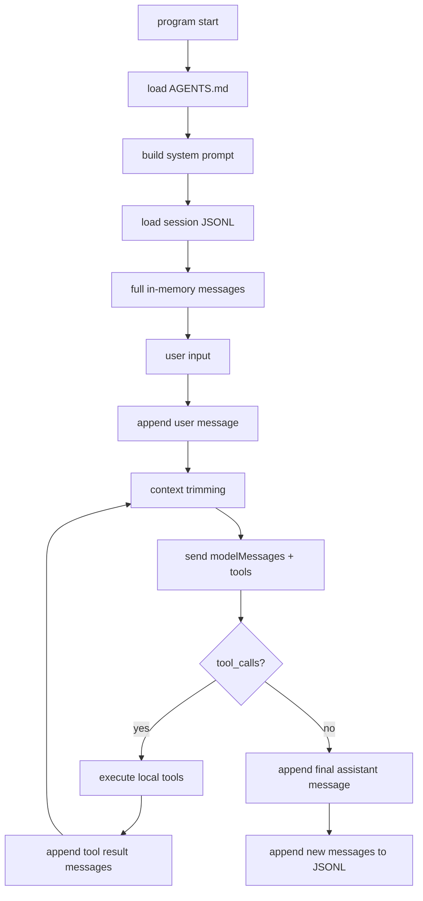

# MiniAgent

MiniAgent is a small Go learning project for building a minimal command-line agent harness.

It demonstrates the core pieces of a coding agent:

- OpenAI-compatible chat completion
- tool calling
- an agent loop
- local read-only tools
- JSONL session persistence
- multiple sessions
- `AGENTS.md` project instructions
- recent-message context trimming
- debug output for raw API request/response JSON

The code intentionally stays compact and standard-library first so each layer is easy to inspect while learning.

## Branch Roadmap

`main` contains the completed MiniAgent v1 learning harness.

`MiniAgent_V2` is the branch for the next stage: evolving the mini harness into a more controllable coding agent prototype. The v2 work should keep the v1 learning value intact while improving structure, safety, observability, and extensibility.

Recommended v2 focus areas:

- move the agent loop out of `cmd/miniagent` and into `internal/agent`
- split file tools into smaller files
- introduce a permission model before adding write or shell tools
- restore streaming for plain chat paths
- add safer file editing tools
- add command execution only behind approval
- improve context trimming with summaries
- add structured logs and richer session inspection

## Quick Start

Set an API key for an OpenAI-compatible provider:

```bash
export ZAI_API_KEY="your-api-key"
```

Optional provider settings:

```bash
export ZAI_BASE_URL="https://open.bigmodel.cn/api/paas/v4"
export ZAI_MODEL="glm-4.6v"
```

Run one prompt:

```bash
go run ./cmd/miniagent "hello"
```

Run interactive mode:

```bash
go run ./cmd/miniagent
```

## Interactive Commands

Inside interactive mode:

```text
/help
/history
/debug-api
/clear
/session
/session list
/session use <id>
/session new <id>
/exit
```

`/history` prints the in-memory `[]llm.Message` history for the current session.

`/debug-api` toggles raw and pretty JSON printing for API requests and responses. This is useful for seeing `tools`, `tool_calls`, and trimmed message payloads.

`/clear` clears the current session history in memory and in `sessions/<id>.jsonl`.

`/session use <id>` switches to a saved session, creating an empty one if no file exists yet.

## Environment Variables

Model/provider:

```text
ZAI_API_KEY
ZAI_BASE_URL
ZAI_MODEL
```

Fallback API variables are also supported:

```text
ZHIPUAI_API_KEY / ZHIPUAI_BASE_URL / ZHIPUAI_MODEL
GLM_API_KEY / GLM_BASE_URL / GLM_MODEL
OPENAI_API_KEY / OPENAI_BASE_URL / OPENAI_MODEL
MINIAGENT_API_KEY / MINIAGENT_BASE_URL / MINIAGENT_MODEL
```

Runtime:

```text
MINIAGENT_SESSION=study
MINIAGENT_DEBUG_API=1
MINIAGENT_CONTEXT_MESSAGES=40
```

`MINIAGENT_CONTEXT_MESSAGES` controls how many non-system messages are sent to the model. The full session is still kept in memory and persisted to disk.

## Tools

MiniAgent currently exposes four local tools to the model:

```text
get_time
list_files
read_file
grep_text
```

The model sees only each tool's schema and description. The Go program decides whether the requested tool exists, executes it locally, then feeds the result back as a `role=tool` message.

Examples:

```text
现在几点？
递归列出当前项目文件，最多 20 个
读取 README.md
搜索 generaterequest，不区分大小写，最多 10 个
```

The file tools are read-only and constrained to the workspace.

## Project Structure

```text
cmd/miniagent/          CLI entry point and current orchestration glue
internal/llm/           provider-neutral message types and OpenAI-compatible client
internal/agent/         tool dispatcher and agent struct skeleton
internal/tools/         local tool interface and tool implementations
internal/session/       JSONL session store
internal/contextx/      context trimming
internal/project/       AGENTS.md discovery
internal/prompt/        system prompt construction
docs/                   learning notes
sessions/               JSONL session files
AGENTS.md               project-level instructions loaded into the system prompt
```

## Runtime Flow



The important separation is:

```text
full messages   = complete session history for /history and JSONL persistence
modelMessages   = trimmed messages sent to the model for one request
```

## MiniAgent v2 Plan

This branch replaces the v1 learning plan with the v2 refactor and capability plan. The next version should grow in small, reviewable steps.

The goal for v2:

```text
Move from a compact learning harness to a more controllable coding agent prototype.
```

Recommended order:

1. Move `runAgentLoop` and tool-result handling into `internal/agent`.
2. Split `internal/tools/files.go` into `list_files.go`, `read_file.go`, `grep_text.go`, and shared path helpers.
3. Add a tool permission model before adding any write-capable tool.
4. Add `write_file` only with explicit approval and path safety checks.
5. Add safer patch-style editing, where the old text must match uniquely.
6. Add a restricted `run_shell` tool with timeout, output limits, and approval.
7. Add session inspection commands for viewing timestamps, tool calls, and raw stored messages.
8. Add structured logs for model calls, tool calls, latency, and errors.
9. Add summary-based context trimming once recent-N trimming becomes too lossy.
10. Update docs and tests after each capability lands.

Suggested v2 learning path:

```text
Day 1  refactor agent loop into internal/agent
Day 2  split file tools and shared path safety helpers
Day 3  restore streaming for plain chat paths
Day 4  design tool permissions and approval flow
Day 5  add write_file with explicit approval
Day 6  add safer edit_file based on unique old/new replacement
Day 7  add restricted run_shell with timeout and output limits
Day 8  add a simple task plan state
Day 9  add summary-based context trimming
Day 10 add session inspect/export commands
Day 11 add structured JSONL logs
Day 12 add a config file layer
Day 13 explore lightweight project indexing
Day 14 update docs, tests, and v2 architecture notes
```

The main principle for v2:

```text
Model proposes actions.
MiniAgent validates, limits, logs, and executes them.
```

## Learning Notes

Current notes:

- `docs/day03-context-and-session.md`
- `docs/day10-mini-harness.md`

New v2 notes should be added under `docs/` as each v2 step lands.

## Tests

Run:

```bash
go test ./...
```

The tests cover:

- agent loop tool-result feedback
- context trimming behavior
- `AGENTS.md` discovery
- system prompt composition
- JSONL session store
- file tools
