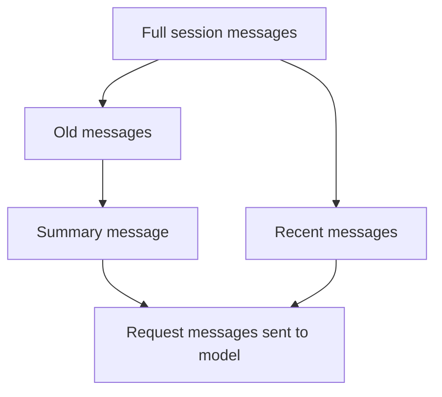
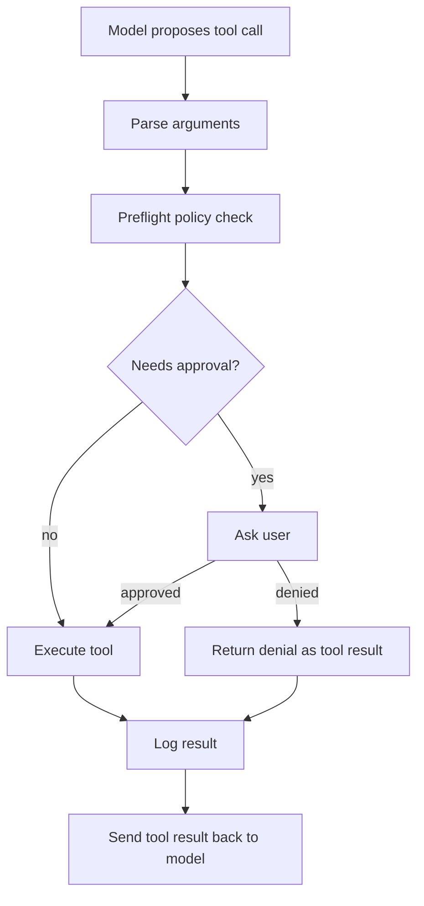
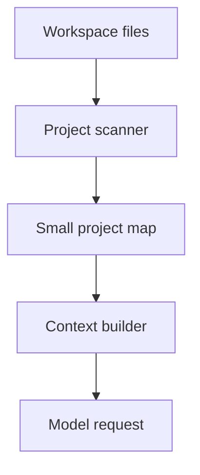

# MiniAgent Agent-Core Roadmap

This roadmap replaces the old Day 10-14 plan with a more agent-focused path.
The goal is to spend less time on generic engineering polish and more time on
the core mechanics behind modern coding agents.

## Current Position

MiniAgent already has the basic harness pieces:

- messages, sessions, and recent-message context trimming
- an agent loop that can call tools repeatedly
- read, write, edit, shell, and skill-script tools
- permission checks, approval prompts, preflight checks, and allowlists
- task planning through a planner skill
- skill catalog, skill routing, skill body loading, and local manifests
- JSONL logs for API calls, tool calls, plans, approvals, and skill scripts

That means the next work should deepen the agent-core layers instead of adding
more surface commands first.

## Revised Plan

```text
Day 10  Full-flow consolidation
Day 11  Summary-based context compression
Day 12  Tool execution engineering
Day 13  Skill orchestration
Day 14  Lightweight project context/indexing
```

## Day 10: Full-Flow Consolidation

Core question:

```text
How does one user task move through messages, planner, tools, approvals,
logs, and final answer generation?
```

Deliverables:

- a full-flow learning document
- architecture and data-flow diagrams
- a clear vocabulary for planner, executor, tool, skill, manifest, and log

Status:

```text
Mostly done. See docs/agent-harness-full-flow.md.
```

## Day 11: Summary-Based Context Compression

Core question:

```text
When the conversation gets long, how can MiniAgent keep important memory
without sending every old message to the model?
```

Why it matters:

Recent-N trimming is simple, but it can forget important earlier facts. Summary
compression introduces a middle layer: old messages are condensed into a short
summary, and recent messages stay verbatim.

Expected shape:



Possible MiniAgent implementation:

- keep the current full session history on disk
- build request context from system message + summary + recent messages
- add a command or internal trigger to refresh the summary
- log when summary compression happens

Status:

```text
Implemented as a first learning version. See docs/day11-context-summary.md.
```

## Day 12: Tool Execution Engineering

Core question:

```text
How does MiniAgent decide whether a tool call is allowed, safe, observable,
and recoverable?
```

Focus areas:

- unify tool preflight behavior
- make tool failure reasons clearer to the model and user
- improve retry and correction paths when a tool call fails
- make approval, preflight, execution, timeout, and truncation visible in logs
- keep tool schemas precise so the model has fewer invalid choices

Expected flow:



Status:

```text
Implemented as a first Tool Recovery Layer. See docs/day12-tool-recovery.md.
```

## Day 13: Skill Orchestration

Core question:

```text
How does MiniAgent move from selecting a skill to actually using that skill
inside a task?
```

Current state:

- skill catalog can expose names and descriptions
- router can select one skill
- loader can inject the chosen skill body
- manifest can declare which scripts are allowed
- script runner can execute allowed scripts behind approval

Implemented flow:

```text
/task -> route skill -> load selected skill instructions -> plan -> execute
```

This turns skills from a demo command into part of the real agent workflow.

Status:

```text
Implemented as a first skill orchestration flow. See docs/day13-skill-orchestration.md.
```

## Day 14: Lightweight Project Context / Indexing

Core question:

```text
How can MiniAgent understand a project before calling read_file or grep_text
many times?
```

This is not full RAG yet. It should be a small local project map:

- important directories
- Go packages
- main entrypoints
- available docs
- known skills
- recently touched files

Expected flow:



## Deferred Work

These are useful, but they are no longer the learning priority:

- session inspect/export commands
- broad config file layer
- large automated test harness
- release packaging

They can return later when MiniAgent moves from learning prototype to a more
engineering-grade project.

## Later Advanced Topics

After Day 11-14, the next agent-development topics are:

- MCP integration
- external file authorization boundaries
- long-term memory and RAG
- multi-agent or sub-agent orchestration
- richer terminal UI with command suggestions
