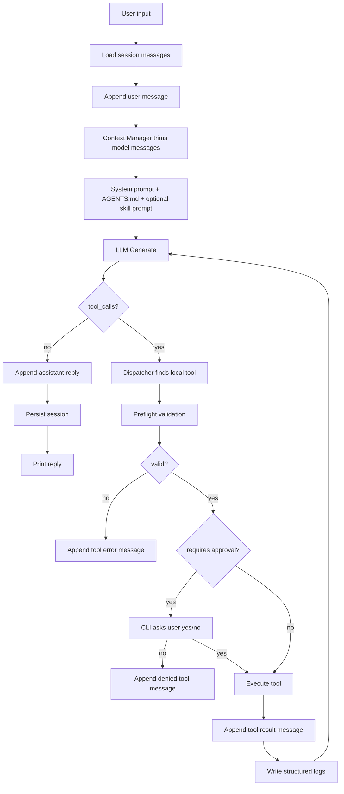
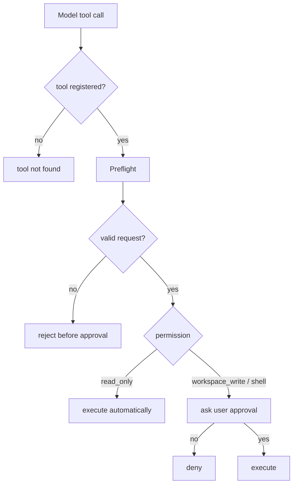
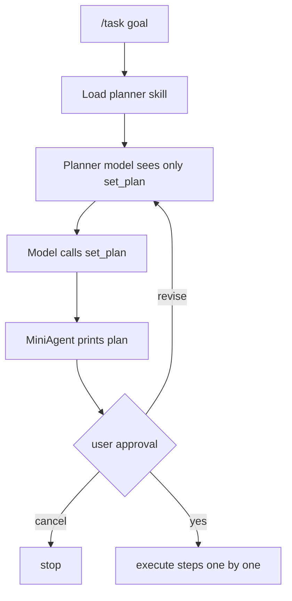
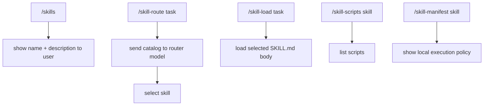

# Agent Harness Full Flow

这份文档用来归纳 MiniAgent 目前已经实现的 Agent Harness 全流程。

MiniAgent 现在已经不是单纯的聊天 CLI，而是一个最小但完整的 agent harness 学习模型：

```text
message/context -> model -> tool_call -> dispatcher -> preflight -> approval -> execution -> tool result -> logs -> next model turn
```

## One Sentence

Agent Harness 的职责不是“替模型思考”，而是：

```text
把模型的意图变成受控、可观察、可回滚边界内的本地行为。
```

模型负责提出：

```text
我要调用哪个工具
我要传什么参数
我下一步怎么回答
```

MiniAgent 负责决定：

```text
这个工具是否存在
这个参数是否安全
是否需要用户审批
是否真的执行
执行结果如何记录
如何把结果反馈给模型
```

## Full Data Flow



## Core Concepts

### Messages

代码位置：

```text
internal/llm/types.go
```

MiniAgent 用 `[]llm.Message` 表示对话历史。

核心 role：

```text
system     系统规则，比如 BaseSystemPrompt + AGENTS.md
user       用户输入
assistant 远端模型回复，也包括 tool_calls
tool       本地工具执行结果
```

关键理解：

```text
模型没有真正“记忆”。
所谓多轮对话，是 MiniAgent 每次把历史 messages 重新发给模型。
```

### Context

代码位置：

```text
internal/contextx/manager.go
```

MiniAgent 保存完整 session，但发送给模型前会做 recent-N 裁剪。

这解决的是：

```text
本地完整记忆要保留
模型上下文不能无限增长
```

### System Prompt And AGENTS.md

代码位置：

```text
internal/prompt/system.go
internal/project/agentsmd.go
AGENTS.md
```

启动时 MiniAgent 会读取 `AGENTS.md`，合并到 system prompt。

这说明 project instruction 是一种本地提示词来源：

```text
BaseSystemPrompt
+ AGENTS.md
= runtime system prompt
```

### Tools

代码位置：

```text
internal/tools/tool.go
internal/tools/*.go
```

Tool 是 MiniAgent 暴露给模型的本地能力。

每个 tool 都有：

```text
Name
Description
Permission
Schema
Execute
```

模型看到的是 schema：

```text
name
description
parameters
```

真正执行的是 Go 代码。

### Tool Calling

模型返回：

```json
{
  "tool_calls": [
    {
      "function": {
        "name": "read_file",
        "arguments": "{\"path\":\"README.md\"}"
      }
    }
  ]
}
```

MiniAgent 做：

```text
解析 tool_calls
找到 Go tool
执行或拒绝
把结果作为 role=tool message 返回模型
```

### Agent Loop

代码位置：

```text
internal/agent/loop.go
```

Agent loop 的核心是：

```text
模型请求工具
本地执行工具
工具结果返回模型
模型继续回答或继续调用工具
```

这就是 agent 和普通聊天最大的区别之一。

## Safety Layers

MiniAgent 现在有多层安全边界。



### Permissions

代码位置：

```text
internal/tools/tool.go
internal/agent/approval.go
```

权限类型：

```text
read_only          自动执行
workspace_write    需要审批
shell              需要审批
agent_state        修改 harness 内部状态，不碰文件系统
```

### Preflight

代码位置：

```text
internal/tools/tool.go
internal/agent/dispatcher.go
```

Preflight 是审批前校验：

```text
如果请求明显不可能执行，就直接拒绝
不要先问用户 yes
```

典型例子：

```text
run_skill_script 请求 xlsx/scripts/recalc.py
manifest 没有 allowed=true
=> preflight 直接拒绝
```

### Approval

代码位置：

```text
cmd/miniagent/main.go
internal/agent/approval.go
```

审批让用户知道：

```text
模型准备执行哪个工具
权限是什么
参数是什么
```

只有输入 `yes` 才执行。

## Planner

代码位置：

```text
internal/plan/plan.go
internal/tools/plan.go
skills/planner/SKILL.md
```

`/task <goal>` 使用 planner agent。

流程：



关键点：

```text
planner 只负责计划
runtime agent 才负责执行
harness 负责标记 step 状态
```

## Skills

代码位置：

```text
internal/skill/
skills/*/SKILL.md
cmd/miniagent/main.go
```

Skill 是可加载的本地工作流说明。

MiniAgent 当前支持：

```text
/skills
/skill <name>
/skill-route <task>
/skill-load <task>
/skill-scripts <skill>
/skill-manifest <skill>
```

### Progressive Disclosure



这就是渐进式披露：

```text
先给目录
再选 skill
再加载正文
再发现脚本
再查看授权
最后才受控执行
```

## Manifest

代码位置：

```text
skills/demo/manifest.local.json
skills/xlsx/manifest.local.json
internal/skill/skill.go
internal/tools/skill_script.go
```

`manifest.local.json` 是本地执行授权文件。

它不是给模型看的说明文档，而是给 harness 看的权限策略。

示例：

```json
{
  "scripts": [
    {
      "path": "scripts/inspect_args.py",
      "runner": "python3",
      "allowed": true,
      "requires_approval": true,
      "timeout_seconds": 5,
      "max_output_bytes": 4000,
      "args": [
        {"type": "string"},
        {"type": "integer"}
      ]
    }
  ]
}
```

当前支持 runner：

```text
direct
python3
```

当前支持参数类型：

```text
string
integer
```

## Script Execution

代码位置：

```text
internal/tools/skill_script.go
skills/demo/scripts/
```

`run_skill_script` 是受控脚本执行工具。

执行条件：

```text
script 必须在 manifest.local.json 中 allowed=true
script 路径必须在 skills/<skill>/scripts/ 内
runner 必须是允许的 runner
参数必须通过 manifest 校验
shell 权限必须经过用户审批
执行有 timeout
输出有截断
```

它不是通用脚本执行器。

## Logs And Audit

代码位置：

```text
internal/logx/logx.go
logs/miniagent.jsonl
```

常用命令：

```text
/logs
/logs type tool_call
/logs type tool_result
/logs type skill_script_preflight
/logs type skill_script_execute
/logs errors
```

脚本执行相关事件：

```text
skill_script_preflight
skill_script_execute
```

这些日志回答的是：

```text
模型请求了什么
harness 是否允许
用户是否批准
脚本是否执行
执行结果是什么
```

## Current Learning Status

已经完成：

```text
messages/session/context
OpenAI-compatible API debug
tool calling
multi-turn agent loop
read/write/edit/shell tools
approval and permission model
planner agent
structured logs
skills loader
skill routing
skill body loading
script discovery
manifest local policy
direct/python3 script runner
script execution audit
```

暂缓：

```text
真实启用 docx/pdf/xlsx 复杂脚本
外部文件路径授权
allowed_roots
MCP
长期记忆 / RAG
生产级沙箱
```

## Recommended Next Learning Order

```text
1. 复盘当前 full flow，能手画数据流图
2. 给 xlsx/recalc.py 做风险分析，但不急着授权
3. 学习 MCP：把外部工具协议和本地 tools 对比
4. 学习 allowed_roots / external approval
5. 再进入工程化项目级落地
```

## Mental Model

可以把 MiniAgent 分成三层：

```text
Model Layer
LLM messages / tool_calls / skill prompt

Harness Layer
agent loop / dispatcher / preflight / approval / logs

Local Capability Layer
tools / scripts / files / shell / manifest policy
```

真正的 Agent 开发，核心就是不断打磨 Harness Layer。
