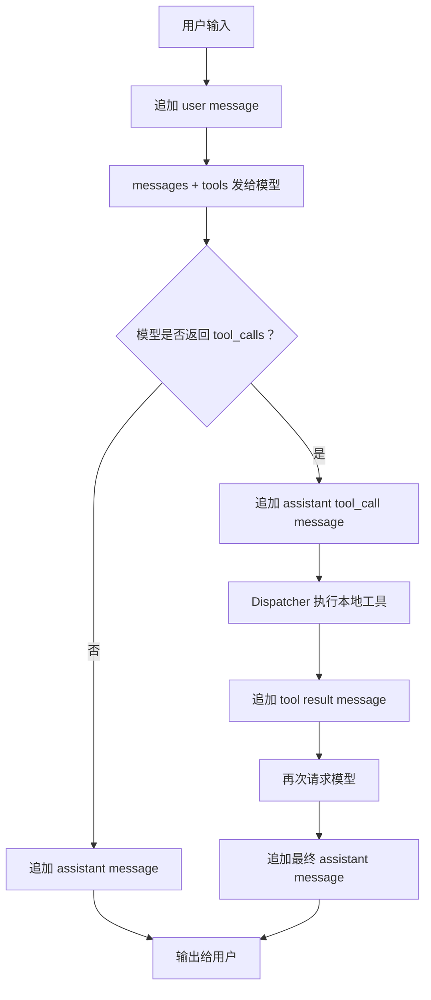

# Day 03: Context And Session Notes

本文件用于记录 MiniAgent 第三天学习内容：上下文、messages、内存 session，以及 tool result 为什么也属于上下文的一部分。

后续关于上下文模型的总结、自我理解和实验观察，都可以继续追加到这个文档里。

## 核心结论

MiniAgent 的上下文本质上是一个有顺序的消息列表：

```text
[]llm.Message
```

一次对话不是模型自己永久记住了什么，而是程序每次请求模型时，把当前这轮 session 中的 messages 一起发送给模型。

当前内存 session 大致长这样：

```text
system
user
assistant
user
assistant
...
```

如果涉及工具调用，还会出现：

```text
assistant tool_calls
tool result
assistant final answer
```

## 1. 为什么模型能记住我叫 yxf？

因为程序把前面的对话保存在内存里的 `messages` 数组中。

例如你第一次输入：

```text
我叫 yxf
```

程序会把它追加成一条 user message：

```text
role=user content="我叫 yxf"
```

模型回复以后，程序又会把 assistant 的回复追加进 messages。

第二次你问：

```text
我叫什么名字？
```

程序不是只把这一句话发给模型，而是把完整历史一起发过去：

```text
system: You are MiniAgent...
user: 我叫 yxf
assistant: 你好，yxf...
user: 我叫什么名字？
```

所以模型能回答“你叫 yxf”，不是因为它在服务器上永久记住了你，而是因为 MiniAgent 在本次 session 里保存并重新发送了历史消息。

## 2. `/clear` 之后为什么模型不知道我是谁？

`/clear` 的本质是重置内存里的 messages。

当前代码中，`/clear` 会重新调用：

```go
messages = newConversation()
```

而 `newConversation()` 只会创建一条 system message：

```text
system: You are MiniAgent...
```

也就是说，之前这些内容会从当前内存 session 中消失：

```text
user: 我叫 yxf
assistant: 你好，yxf...
```

清空以后再问：

```text
我叫什么名字？
```

模型收到的上下文只剩：

```text
system: You are MiniAgent...
user: 我叫什么名字？
```

这里没有“我叫 yxf”这条历史，所以模型自然不知道你的名字。

结论：

```text
记忆 = messages
清空 messages = 清空当前 session 的记忆
```

## 3. `/history` 看到的 messages 和 `/debug-api` 看到的 request body 有什么关系？

`/history` 看到的是 MiniAgent 当前内存里的 messages。

`/debug-api` 看到的是实际发送给远端 API 的 HTTP JSON 请求体和响应体。

二者关系是：

```text
/history 中的 messages
-> 转换成 OpenAI-compatible messages
-> 放进 API request body
-> 发送给远端模型
```

例如 `/history` 里看到：

```text
01. role=system content="..."
02. role=user content="现在几点？"
03. role=assistant content="..." tool_calls=[get_time]
04. role=tool content="2026-05-02T19:04:21+08:00" tool_call_id=...
```

那么 `/debug-api` 的第二轮 request body 里也会出现对应结构：

```json
{
  "messages": [
    {"role": "system", "content": "..."},
    {"role": "user", "content": "现在几点？"},
    {
      "role": "assistant",
      "content": "...",
      "tool_calls": [...]
    },
    {
      "role": "tool",
      "content": "2026-05-02T19:04:21+08:00",
      "tool_call_id": "...",
      "name": "get_time"
    }
  ]
}
```

区别是：

```text
/history 是内部状态的简化展示
/debug-api 是真实网络请求和响应的原始 JSON
```

## 4. assistant 的回复为什么也要保存进 messages？

因为 assistant 的回复也是对话历史的一部分。

如果只保存 user message，不保存 assistant message，模型下一轮就不知道自己之前说过什么。

例如：

```text
user: 帮我列一个学习计划
assistant: 好，我建议分成 3 步...
user: 第二步展开讲讲
```

如果没有保存 assistant 的回复，模型看到的可能只是：

```text
system: ...
user: 帮我列一个学习计划
user: 第二步展开讲讲
```

这时“第二步”到底是什么就不清楚了。

保存 assistant 回复以后，上下文才完整：

```text
system: ...
user: 帮我列一个学习计划
assistant: 好，我建议分成 3 步...
user: 第二步展开讲讲
```

所以 assistant message 的作用是让模型在下一轮知道：

```text
我刚才回答过什么
用户现在的追问指向哪里
```

## 5. tool result 为什么也是一种 message？

工具调用分成两步：

```text
模型提出工具调用请求
程序执行本地工具并返回结果
```

模型不能直接执行 Go 函数。它只能返回结构化的 tool call，例如：

```json
{
  "tool_calls": [
    {
      "function": {
        "name": "get_time",
        "arguments": "{}"
      }
    }
  ]
}
```

真正执行的是 MiniAgent 的 Go 程序：

```go
dispatcher.Execute(ctx, call)
```

执行完成后，程序必须把结果告诉模型。这个结果就被包装成一条 `role=tool` message：

```text
role=tool content="2026-05-02T19:04:21+08:00" tool_call_id=... tool_name=get_time
```

为什么要放进 messages？

因为第二轮请求模型时，模型需要看到：

```text
assistant: 我想调用 get_time
tool: get_time 的结果是 2026-05-02T19:04:21+08:00
```

然后模型才能基于工具结果生成最终回答：

```text
现在是 2026 年 5 月 2 日晚上 7 点 04 分。
```

所以 tool result 不是普通日志，而是对话上下文的一部分。

## 数据流图



## 当前理解

可以先用一句话总结第三天：

```text
MiniAgent 的记忆不是模型自己的长期记忆，而是程序维护的 messages；每轮请求都把当前 messages 发送给模型，模型基于这份上下文继续对话。
```

后续学习时，可以继续在这里补充：

```text
- 我对 messages 的理解
- 我对 session 的理解
- 我对 tool message 的理解
- 我观察 /debug-api 后发现的现象
- 我踩过的坑和修正
```
