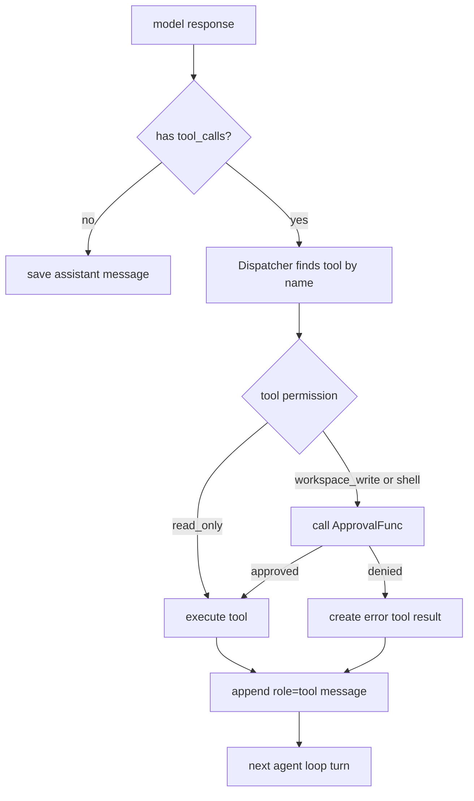

# Day 04: Tool Permissions And Approval Flow

第 4 天的目标是给 MiniAgent 加上工具权限边界。

这一步暂时不是为了新增强工具，而是为了先回答一个更关键的问题：

```text
模型可以请求工具，但到底能不能执行，应该由谁决定？
```

答案是：由 harness 决定，也就是 MiniAgent 的 Go 代码决定。

## Why

只读工具比较安全，例如：

```text
get_time
list_files
read_file
grep_text
```

这些工具最多读取信息，不会修改项目，也不会执行命令，所以可以自动运行。

但是后面要加入的工具风险更高：

```text
write_file
edit_file
run_shell
```

这些工具可能改变文件、覆盖内容、运行命令。不能因为模型返回了
`tool_calls`，程序就立刻执行。

## Permission Levels

MiniAgent 现在在 `internal/tools/tool.go` 里定义了权限等级：

```text
read_only
workspace_write
shell
```

每个工具都要实现：

```go
Permission() tools.Permission
```

这样 Dispatcher 在执行工具之前，就能先看这个工具属于哪种权限。

## Runtime Flow



注意：审批发生在工具真正执行之前。

也就是说：

```text
tool_call 是模型提出的请求
ApprovalFunc 是 MiniAgent 的安全边界
Execute 才是真正的本地执行
```

## Why Approval Is In Agent, Not Tool

工具只应该负责自己的业务逻辑。

例如未来的 `write_file` 应该负责：

```text
解析 path/content
检查路径不能逃逸 workspace
写入文件
返回结果
```

它不应该负责：

```text
问用户 yes/no
决定权限策略
管理 CLI 交互
```

这些属于 harness 层。

所以 MiniAgent 把审批放在：

```text
internal/agent/approval.go
internal/agent/dispatcher.go
```

CLI 只是提供一个具体的 approver：

```text
Tool approval required: write_file
permission: workspace_write
arguments: {"path":"demo.txt"}
Approve? type yes to continue:
```

## Connection To Skills And MCP

后面学习 skills 和 MCP 时，这个边界会继续存在。

可以这样理解：

```text
skill    = 教模型/Agent 如何完成某类任务的说明和流程
tool     = 一个可以被调用的具体能力
MCP      = 一种把外部工具暴露给 Agent 的协议
harness  = 决定上下文、权限、执行、日志、状态的运行框架
```

不管工具来自本地 Go 代码，还是来自 MCP server，harness 都应该保留最终控制权：

```text
模型提出动作
MiniAgent 检查权限
用户或配置批准
本地程序执行
结果再交回模型
```

这就是第 4 天最重要的学习点。
