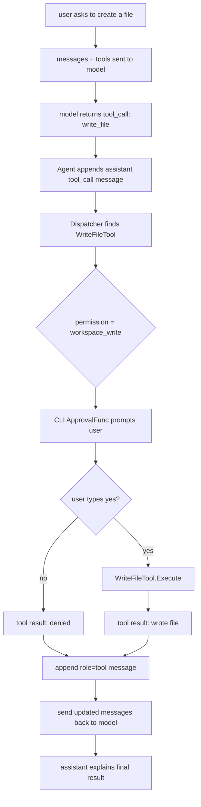
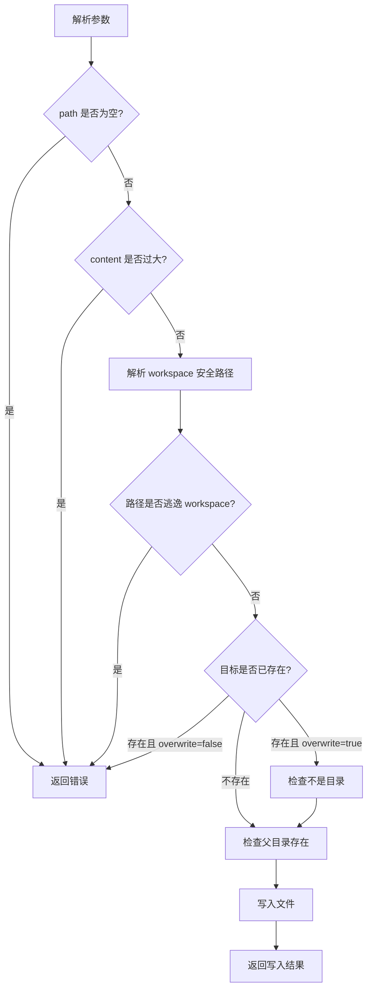

# Day 05: Write File With Approval

第 5 天的目标是加入第一个真正有副作用的工具：`write_file`。

这一步会把第 4 天的权限模型真正用起来。

## Goal

`write_file` 允许模型请求写入 workspace 内的文本文件，但执行前必须经过审批。

它的权限是：

```text
workspace_write
```

所以它不会像 `read_file`、`grep_text` 那样自动执行。

## Data Flow



## Business Flow



## Important Rules

`write_file` 是保守设计：

```text
只能写 workspace 内文件
默认不覆盖已有文件
不会自动创建父目录
最多写入 100000 bytes
不能写目录
```

这些限制不是为了麻烦，而是为了让 agent harness 的副作用更可控。

## How To Try

启动交互模式：

```bash
go run ./cmd/miniagent
```

建议打开 API 调试：

```text
/debug-api
```

然后输入：

```text
创建一个 notes.txt，内容是 hello from MiniAgent
```

如果模型调用 `write_file`，你应该看到类似审批提示：

```text
Tool approval required: write_file
permission: workspace_write
arguments: {"content":"hello from MiniAgent","path":"notes.txt"}
Approve? type yes to continue:
```

输入：

```text
yes
```

然后可以验证：

```text
读取 notes.txt
/history
```

重点观察 `/history`：

```text
assistant tool_calls=[write_file {...}]
tool content="wrote file: notes.txt (...)"
assistant content="..."
```

这说明 `write_file` 不是模型自己执行的，而是 MiniAgent 审批后在本地执行的。
