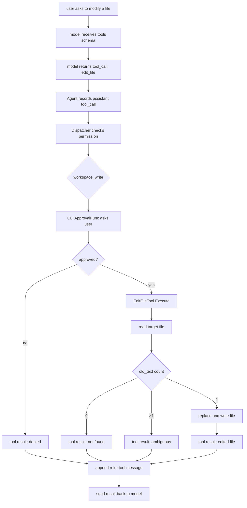
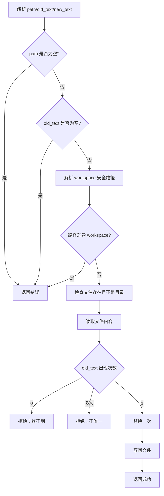

# Day 06: Safe Edit File

第 6 天的目标是加入更适合 coding agent 的局部编辑工具：`edit_file`。

`write_file` 是整文件写入，适合创建文件；`edit_file` 是精确替换，适合修改已有代码。

## Tool Contract

`edit_file` 接收三个核心参数：

```text
path
old_text
new_text
```

它做的事情非常克制：

```text
读取 path
确认 old_text 在文件中只出现一次
把 old_text 替换成 new_text
写回文件
```

权限是：

```text
workspace_write
```

所以它和 `write_file` 一样，必须先经过审批。

## Data Flow



## Business Flow



## Why Unique Replacement

这是 Day 6 最重要的学习点。

如果模型只说：

```text
把 foo 改成 bar
```

但文件里有 5 个 `foo`，MiniAgent 不应该猜到底改哪一个。

所以 `edit_file` 要求：

```text
old_text 必须足够具体
old_text 必须在文件里只出现一次
```

这能迫使模型先读取文件、拿到上下文，再构造更精确的替换片段。

## How To Try

先创建一个文件：

```text
创建 demo.txt，内容是 hello MiniAgent
```

审批通过后，再输入：

```text
把 demo.txt 里的 hello MiniAgent 改成 hello edit_file
```

如果模型调用 `edit_file`，你会看到审批：

```text
Tool approval required: edit_file
permission: workspace_write
arguments: {"new_text":"hello edit_file","old_text":"hello MiniAgent","path":"demo.txt"}
Approve? type yes to continue:
```

输入：

```text
yes
```

然后验证：

```text
读取 demo.txt
/history
```

重点观察：

```text
assistant tool_calls=[edit_file {...}]
tool content="edited file: demo.txt (replaced 1 occurrence)"
```

这说明 MiniAgent 已经具备了一个最小但安全的局部编辑能力。
