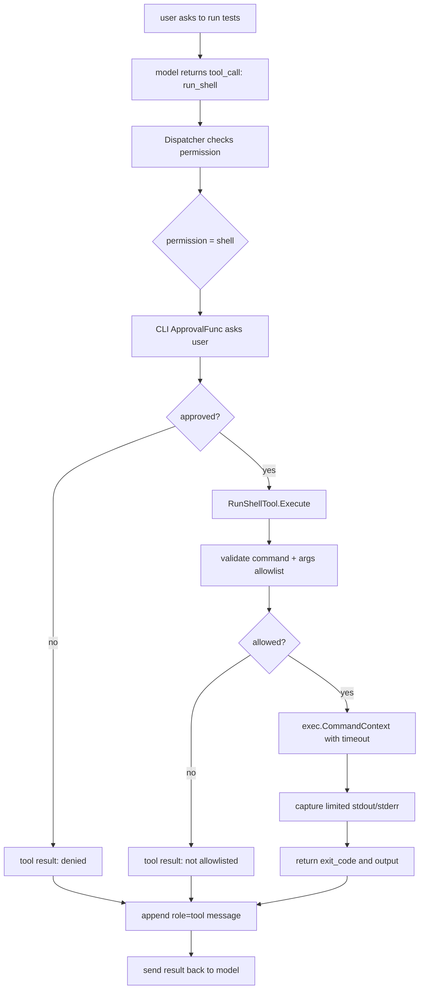
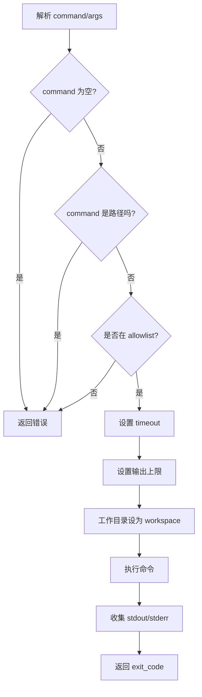

# Day 07: Restricted Run Shell

第 7 天的目标是加入第一个“执行层”工具：`run_shell`。

这一步很重要，因为真实 coding agent 不只是读代码和改代码，还需要验证：

```text
读代码 -> 修改文件 -> 跑测试 -> 根据结果继续修
```

但是 shell 命令风险很高，所以 MiniAgent 的第一版 `run_shell` 非常保守。

## Tool Contract

`run_shell` 使用结构化参数：

```json
{
  "command": "go",
  "args": ["test", "./..."],
  "timeout_seconds": 30,
  "max_output_bytes": 12000
}
```

注意：它不是一整段 shell 字符串。

也就是说，MiniAgent 不会执行：

```text
sh -c "go test ./... && rm -rf tmp"
```

而是执行：

```text
command = "go"
args = ["test", "./..."]
```

这样可以避开管道、重定向、后台进程、命令拼接等复杂风险。

## Allowed Commands

第一版只允许少量验证命令：

```text
go version
go test ./...
go test ./cmd/...
go test ./internal/...
git status --short
git diff --stat
```

其他命令会被拒绝，例如：

```text
rm -rf .
sh -c ...
go env
git push
```

## Data Flow



## Business Flow



## Why Approval Still Matters

allowlist 只能限制命令范围，审批负责让用户知道马上要发生什么。

两者职责不同：

```text
allowlist  = 程序级硬限制
approval   = 用户级确认
timeout    = 防止长时间卡住
output cap = 防止输出过大
```

这就是执行类 tool 最小的安全组合。

## How To Try

启动交互模式：

```bash
go run ./cmd/miniagent
```

输入：

```text
运行 go test ./...
```

如果模型调用 `run_shell`，会看到：

```text
Tool approval required: run_shell
permission: shell
arguments: {"args":["test","./..."],"command":"go"}
Approve? type yes to continue:
```

输入：

```text
yes
```

然后观察 tool result：

```text
command: go test ./...
exit_code: 0
stdout:
...
stderr:
<empty>
```

也可以试一个应该被拒绝的命令：

```text
运行 git push
```

即使你审批了，它也应该被 allowlist 拒绝。
