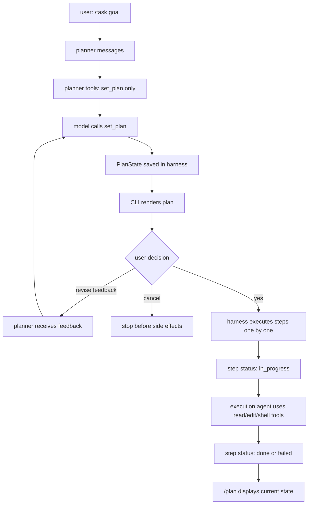
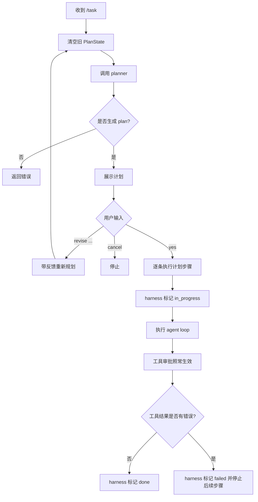

# Day 08: Model Generated Task Plan

第 8 天的目标是让 MiniAgent 具备更接近真实 Agent 的计划流程：

```text
模型生成计划
用户确认或提出修改
确认后由 harness 按步骤执行
用户通过 /plan 查看当前计划
```

## User Flow

用户启动一个计划任务：

```text
/task 实现一个安全的 run_shell 工具
```

MiniAgent 会先让模型只做规划，不执行文件或命令工具。

模型通过 `set_plan` 写入结构化计划，然后 CLI 展示给用户：

```text
Plan: 实现安全 run_shell
1. [pending] 阅读现有工具接口
2. [pending] 设计 command/args schema
3. [pending] 实现 allowlist 和 timeout
4. [pending] 补测试并运行 go test ./...
```

用户可以：

```text
yes
revise 增加一条文档步骤
cancel
```

只有输入 `yes` 后，MiniAgent 才进入真正执行阶段。

Planner 的提示词会告诉模型当前 MiniAgent 的能力边界：

```text
修改文件要用 edit_file
创建文件要用 write_file
测试要用 run_shell go test ./...
不要规划 sed/cat/rm/curl/git push 等不支持的命令
```

这很重要，因为计划必须基于 harness 真正能执行的能力，而不是泛泛地写“使用 sed 修改文件”。

## Data Flow



## Business Flow



## PlanState

计划不是聊天文本，而是 harness 保存的结构化状态：

```json
{
  "title": "实现安全 run_shell",
  "steps": [
    {
      "status": "pending",
      "text": "阅读现有工具接口"
    },
    {
      "status": "pending",
      "text": "实现 allowlist 和 timeout"
    }
  ]
}
```

`/plan` 只是读取这份状态并展示。

## Tools

第 8 天新增计划状态工具：

```text
set_plan
```

`set_plan` 用在正式执行前：

```text
模型生成或重写计划
```

它的权限是：

```text
agent_state
```

它只改变 MiniAgent 的内存状态，不写文件、不执行命令，所以不走 `workspace_write` 或 `shell` 审批。

执行阶段的步骤状态不交给模型反复调用工具更新，而是由 harness 自动维护：

```text
开始执行某一步 -> in_progress
该步成功返回 -> done
该步执行报错 -> failed
```

这样可以避免模型陷入“不断调用 update_plan，但不真正执行任务”的循环。

这里的“成功返回”不是只看模型有没有说话，而是看本步骤的工具结果：

```text
工具 IsError=false -> 可以标记 done
工具 IsError=true  -> 标记 failed，停止执行后续步骤
```

例如：

```text
edit_file old_text not found
run_shell command is not allowlisted
go test exit_code != 0
```

这些都应该让当前计划步骤失败，而不是继续盲目执行下一步。

## Why This Is Closer To Real Agents

真实 Agent 往往不是拿到任务就立刻乱跑工具，而是：

```text
先规划
让用户看到计划
接受用户修改
确认后执行
执行中维护进度状态
```

这样用户能知道 Agent 准备做什么，也能在副作用发生之前纠正方向。

## Planner Prompt And Skills

当前 MiniAgent 把 planner prompt 写在 Go 代码里，这是最直接的学习实现。

后续可以把这部分迁移到类似 `SKILL.md` 的文件中：

```text
skills/planner/SKILL.md
```

然后启动时读取文件，把内容注入 planner system prompt。

可以这样理解：

```text
现在：Go 字符串硬编码 planner 规则
以后：SKILL.md 保存 planner 规则，Go 负责加载和注入
```

这样做的好处是：

```text
不用重新编译就能调整规划策略
不同项目可以有不同 planning skill
planner 规则可以像文档一样维护和迭代
```

但在当前阶段，硬编码更容易观察完整数据流，也更容易测试。
