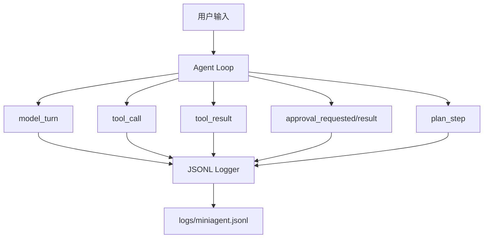
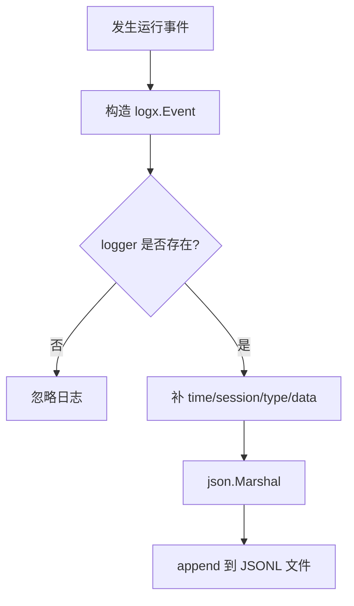

# Day 09: Structured Logs

第 9 天的目标是给 MiniAgent 增加结构化运行日志。

`/history` 记录的是对话消息，主要回答：

```text
模型看到了什么上下文？
```

结构化日志记录的是 harness 运行事件，主要回答：

```text
MiniAgent 实际做了什么？
什么时候调用模型？
调用了哪个工具？
工具是否失败？
用户是否批准？
计划步骤为什么 done 或 failed？
```

## Log File

日志写入：

```text
logs/miniagent.jsonl
```

当前采用的是“全局单文件事件流”：

```text
所有 session 写入同一个 logs/miniagent.jsonl
每条事件通过 session 字段区分归属
查询时再按 session/type/errors 过滤
```

这比按 session 拆多个日志文件更适合后续扩展，因为可以保留完整时间线，也方便以后迁移到 SQLite 的 events 表。

JSONL 的意思是：

```text
一行一个 JSON 事件
```

例如：

```json
{"time":"2026-05-06T18:30:00+08:00","type":"model_turn","session":"default","data":{"turn":1,"message_count":40}}
{"time":"2026-05-06T18:30:01+08:00","type":"tool_call","session":"default","data":{"tool":"edit_file","arguments":"{\"path\":\"notes.txt\"}"}}
{"time":"2026-05-06T18:30:02+08:00","type":"tool_result","session":"default","data":{"tool":"edit_file","is_error":false}}
```

## Data Flow



## Business Flow



## Event Types

当前记录的事件包括：

```text
model_turn
chat_stream
tool_call
tool_result
approval_requested
approval_result
plan_generated
plan_approved
plan_revised
plan_cancelled
plan_step
```

## Why Logs Are Separate From History

`history` 是给模型和用户看的上下文：

```text
role=user
role=assistant
role=tool
```

`logs` 是给 harness 调试和审计看的事件：

```text
模型请求大小
工具参数
审批结果
工具错误
计划状态变化
```

这两个东西不能混在一起。

如果把所有运行事件都塞进 messages，模型上下文会变脏，token 也会变多。

所以 MiniAgent 现在采用：

```text
messages -> session/history
events   -> logs/miniagent.jsonl
```

## How To Try

启动：

```bash
go run ./cmd/miniagent
```

执行一个工具任务：

```text
运行 go test ./...
```

批准后查看日志：

```text
/logs
```

默认只看当前 session。也可以过滤：

```text
/logs all
/logs session default
/logs type tool_result
/logs errors
/logs all errors tail 50
```

也可以在终端直接看：

```bash
tail -n 20 logs/miniagent.jsonl
```

重点观察：

```text
model_turn
tool_call
approval_requested
approval_result
tool_result
```
