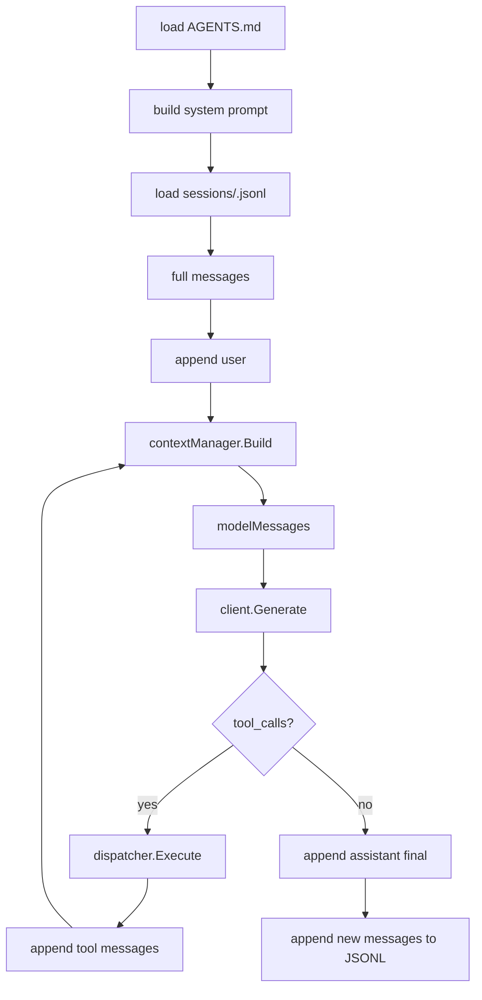

# Day 10: Mini Harness Summary

第 10 天的目标不是继续堆功能，而是把 MiniAgent 收束成一个结构清晰、能继续扩展的小型 agent harness。

## 当前能力

MiniAgent 现在具备这些核心能力：

- 调用 OpenAI-compatible chat completion API
- 暴露本地工具 schema 给模型
- 解析模型返回的 `tool_calls`
- 执行本地 Go 工具
- 把工具结果作为 `role=tool` message 回灌给模型
- 使用 agent loop 支持多轮工具调用
- 用 JSONL 保存 session
- 支持多个 session 并在交互中切换
- 加载 `AGENTS.md` 项目级规则
- 请求模型前做 recent-N context trimming
- 用 `/debug-api` 观察真实 API 请求和响应

## 核心心智模型

MiniAgent 的核心可以压缩成一句话：

```text
维护 messages，裁剪后发给模型；模型请求工具时，由程序执行工具并把结果追加回 messages。
```

完整历史和模型上下文是两件不同的东西：

```text
full messages
完整 session 历史，用于 /history、JSONL 持久化和恢复。

modelMessages
每次请求模型前由 context manager 构建出来的裁剪上下文。
```

这就是第 9 天后最重要的结构分离。

## 数据流



## Module Responsibilities

`cmd/miniagent`

当前 CLI 入口，也承担了不少 orchestration glue：

- 初始化 client/tools/session/context/system prompt
- 处理交互命令
- 调用 agent loop
- 把新增 messages 写入 session

后续如果项目变大，`runAgentLoop` 可以移动到 `internal/agent`。

`internal/llm`

负责 provider-neutral 类型和 OpenAI-compatible wire format 转换。

重点类型：

- `Message`
- `ToolCall`
- `ToolSchema`
- `GenerateRequest`
- `GenerateResponse`
- `Client`

这里最重要的边界是：

```text
内部 Message 结构 != OpenAI HTTP JSON 结构
```

两者通过转换函数隔离。

`internal/tools`

负责本地工具定义和实现。

工具有两面：

```text
Schema()  给模型看的说明书
Execute() 本地真正执行的 Go 代码
```

当前工具：

- `get_time`
- `list_files`
- `read_file`
- `grep_text`

文件工具默认只读，并限制路径不能逃出 workspace。

`internal/agent`

当前主要是 `Dispatcher`：

```text
tool name -> local Tool implementation
```

模型只返回工具名和 arguments；Dispatcher 负责找到本地工具。

`internal/session`

负责 JSONL session 持久化。

每条消息保存成一行：

```json
{"timestamp":"...","message":{"role":"user","content":"..."}}
```

JSONL 的好处是 append 简单、人工可读、适合学习 agent loop。

`internal/contextx`

负责 context trimming。

当前规则：

```text
保留第一条 system message
保留最近 N 条非 system message
```

这样可以控制发给模型的上下文长度，同时保留完整 session 历史。

`internal/project`

负责从当前目录向上查找 `AGENTS.md`。

`internal/prompt`

负责组合 base system prompt 和项目规则。

## Current Limitations

当前 MiniAgent 仍然是学习版，有意保持简单：

- tool calling 暂时走非流式 `Generate`
- agent loop 仍在 `cmd/miniagent/main.go`
- 没有权限审批系统
- 没有写文件或 shell 工具
- 没有 RAG、向量库或长期 memory
- context trimming 只是 recent-N，没有摘要
- session store 是本地 JSONL，不适合高并发服务端

这些限制是可以接受的，因为当前目标是先掌握 agent harness 的最小闭环。

## Useful Manual Tests

观察 `AGENTS.md` 是否加载：

```text
/debug-api
你好
```

查看 request body 第一条 system message 是否包含 `# Project Instructions`。

观察工具 schema 和 tool calls：

```text
/debug-api
搜索 generaterequest，不区分大小写，最多 10 个
```

观察 context trimming：

```bash
MINIAGENT_CONTEXT_MESSAGES=2 go run ./cmd/miniagent
```

多聊几轮后看：

```text
Agent turn 1: sending 3/9 messages to model
```

观察 session 恢复：

```text
我叫 yxf
/exit
```

重新启动后：

```text
/history
```

## Suggested Next Refactors

如果继续做第 11 天之后的内容，可以按这个顺序：

1. 把 `runAgentLoop` 和相关配置移动到 `internal/agent`
2. 拆分 `internal/tools/files.go`
3. 给 session 命令补更多测试
4. 为 context trimming 增加摘要策略
5. 恢复非 tool 场景下的 streaming 输出
6. 增加安全审批后再考虑写文件或 shell 工具

目前 MiniAgent 已经完成了从聊天 CLI 到 mini agent harness 的第一轮学习闭环。

