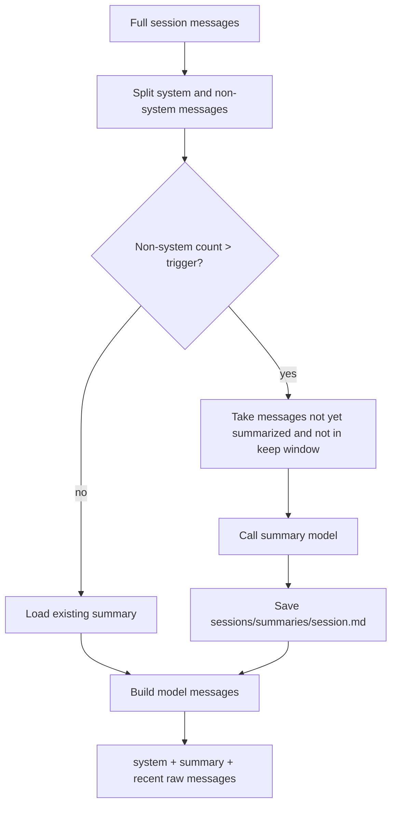

# Day 11: Rolling Summary Context

Day 11 upgrades MiniAgent from simple recent-message trimming to a two-layer
context strategy:

```text
model context = system prompt + rolling summary + recent raw messages
```

The full session is still stored in `sessions/<session>.jsonl`. The summary is
stored separately in:

```text
sessions/summaries/<session>.md
```

## Why This Exists

Recent-N trimming is easy to understand:

```text
send system + last N messages
```

But it forgets older facts completely. Rolling summary keeps a compressed
memory of older history while preserving the newest messages as exact raw
conversation.

## Runtime Flow



## Default Parameters

```text
MINIAGENT_CONTEXT_MESSAGES=20
MINIAGENT_SUMMARY_TRIGGER_MESSAGES=40
MINIAGENT_SUMMARY_KEEP_MESSAGES=20
MINIAGENT_SUMMARY_BATCH_MESSAGES=5
MINIAGENT_SUMMARY_MAX_CHARS=3000
MINIAGENT_SUMMARY_TIMEOUT_SECONDS=20
```

Meanings:

- `MINIAGENT_CONTEXT_MESSAGES`: raw recent messages sent to the model.
- `MINIAGENT_SUMMARY_TRIGGER_MESSAGES`: when to start summary compression.
- `MINIAGENT_SUMMARY_KEEP_MESSAGES`: newest messages left out of summary updates.
- `MINIAGENT_SUMMARY_BATCH_MESSAGES`: minimum number of newly compressible
  messages required before calling the summary model.
- `MINIAGENT_SUMMARY_MAX_CHARS`: character budget for the summary.
- `MINIAGENT_SUMMARY_TIMEOUT_SECONDS`: timeout for one summary update.

The defaults are intentionally small enough for learning and observation.

Summary updates are non-fatal. If the summary model times out or fails,
MiniAgent logs `context_summary_failed` and keeps using the previous summary
plus recent raw messages. The main agent task should continue.

Planner calls use a read-only summary context: they can read the existing
`summary.md`, but they do not trigger summary updates. This keeps planning aware
of long-running context without letting memory maintenance block plan creation.

## Rolling Summary Watermark

The summary file includes front matter:

```markdown
---
session: default
summarized_messages: 20
updated_at: 2026-05-07T20:00:00+08:00
summary_model: primary
---
```

`summarized_messages` is a watermark. It prevents MiniAgent from summarizing the
same old messages again and again.

Example:

```text
total non-system messages = 45
keep messages             = 20
summary target            = 25
previous watermark        = 0

compress messages 1-25
save watermark = 25
```

Later:

```text
total non-system messages = 60
keep messages             = 20
summary target            = 40
previous watermark        = 25

compress messages 26-40
save watermark = 40
```

## Batch Threshold

MiniAgent does not need to call the summary model every time one message slides
out of the recent window. The batch threshold waits until enough messages have
accumulated:

```text
newly compressible messages = summary target - previous watermark

if newly compressible messages < MINIAGENT_SUMMARY_BATCH_MESSAGES:
    do not update summary yet
```

Example:

```text
keep messages             = 20
batch messages            = 5
previous watermark        = 25
total non-system messages = 46
summary target            = 26
newly compressible        = 1

skip summary update
```

Later:

```text
total non-system messages = 50
summary target            = 30
newly compressible        = 5

compress messages 26-30
save watermark = 30
```

## Summary Model

By default, the summary layer reuses the main model. You can set a separate
summary model:

```bash
export MINIAGENT_SUMMARY_MODEL="glm-4.6v"
```

Optional provider overrides:

```bash
export MINIAGENT_SUMMARY_BASE_URL="https://open.bigmodel.cn/api/paas/v4"
export MINIAGENT_SUMMARY_API_KEY_ENV="ZAI_API_KEY"
```

If you want the summary model to use the same DeepSeek credentials as the main
model, you can leave the summary provider variables unset. MiniAgent will fall
back to `DEEPSEEK_API_KEY`, `DEEPSEEK_BASE_URL`, and `DEEPSEEK_MODEL` when those
are the active provider variables.

This is the first step toward model routing:

```text
main model    = planning, tool use, final answers
summary model = compression and memory maintenance
```

## How To Observe

Use small thresholds:

```bash
export MINIAGENT_CONTEXT_MESSAGES=4
export MINIAGENT_SUMMARY_TRIGGER_MESSAGES=6
export MINIAGENT_SUMMARY_KEEP_MESSAGES=4
export MINIAGENT_SUMMARY_BATCH_MESSAGES=2
export MINIAGENT_SUMMARY_MAX_CHARS=1200
export MINIAGENT_SUMMARY_TIMEOUT_SECONDS=10
```

Then run:

```bash
go run ./cmd/miniagent
```

In interactive mode:

```text
/debug-api
```

After enough turns, MiniAgent prints:

```text
Context summary: compressed 2 messages, kept 4 recent messages, summary 800 chars
```

You can inspect the summary:

```text
/summary
```

And inspect logs:

```text
/logs type context_summary_updated
```

If summary generation fails:

```text
/logs type context_summary_failed
```

With `/debug-api` enabled, the request body should show:

```text
system prompt
summary system message
recent raw messages
```

## Important Design Rule

The rolling summary is useful context, but it is not the source of truth.

```text
source of truth = sessions/<session>.jsonl
compressed memory = sessions/summaries/<session>.md
model request = summary + recent messages
```

Keeping the original JSONL session makes it possible to audit, debug, and
regenerate summaries later.
