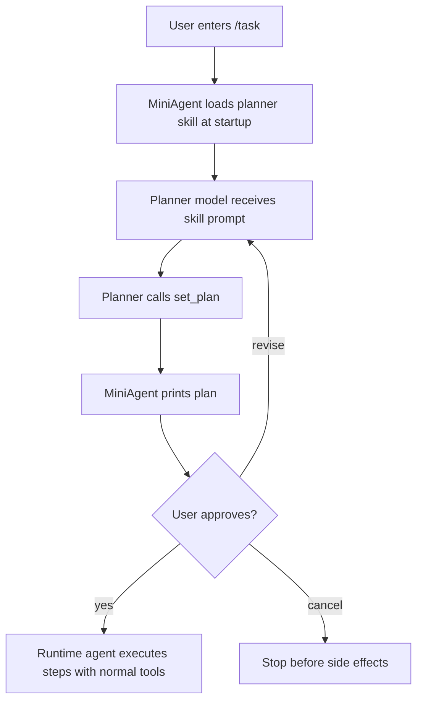
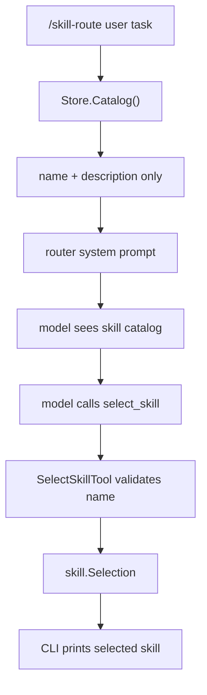
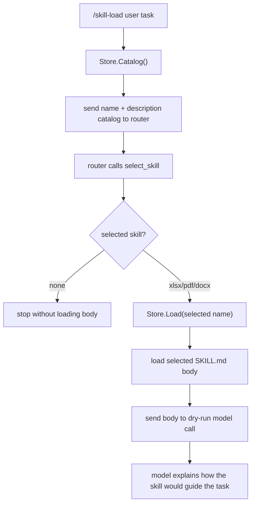
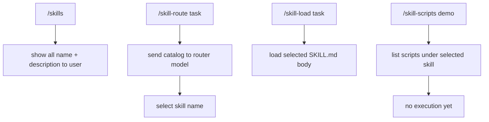
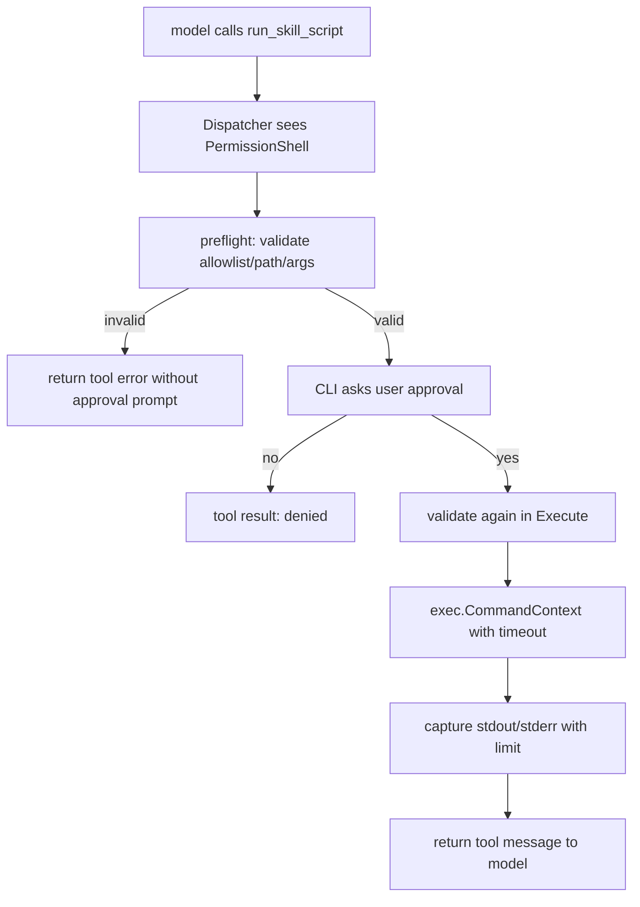

# Day 11: Minimal Skills Loader

这一阶段先做最精简的 skill：让 MiniAgent 能读取本地 `skills/<name>/SKILL.md`，并把 `skills/planner/SKILL.md` 注入 planner 的系统提示词。

这里的重点不是执行脚本，而是理解 skill 的第一层作用：

```text
skill = 一组可复用的模型说明、流程约束、领域经验
tool  = Go 代码中真正可执行的能力
script = skill 包里可选的辅助程序，后续要通过安全包装后才能执行
```

## What We Built

新增了三个部分：

```text
skills/planner/SKILL.md
internal/skill/skill.go
/skills 和 /skill <name> CLI 命令
```

`skills/planner/SKILL.md` 保存 planner 的规划规则。以前这些规则硬编码在 `main.go` 里，现在 MiniAgent 启动时会读取这个文件，把它变成 planner agent 的 system message。

`internal/skill.Store` 负责读取 skill：

```text
Load("planner")
=> skills/planner/SKILL.md
=> 解析 name / description
=> 保留 markdown 正文
=> 组装成可注入模型的 prompt
```

`/skills` 和 `/skill <name>` 是给人看的检查命令，用来确认本地有哪些 skill，以及某个 skill 的内容是什么。

## Data Flow

```mermaid
flowchart TD
    A["skills/planner/SKILL.md"] --> B["skill.Store.Load(\"planner\")"]
    B --> C["Skill.Prompt()"]
    C --> D["planner system message"]
    E["/task user goal"] --> F["generatePlan"]
    D --> F
    F --> G["model sees planner rules"]
    G --> H["model calls set_plan"]
    H --> I["MiniAgent shows plan to user"]
```

这条链路说明：skill 不是模型自动发现的神秘能力。MiniAgent 必须先读取它，再明确塞进模型上下文。

## Business Flow



planner skill 只影响“怎么制定计划”。真正执行计划时，还是 runtime agent 使用 Go 工具：

```text
read_file / grep_text / write_file / edit_file / run_shell ...
```

## Why Scripts Are Not Tools Yet

你复制进来的 `docx`、`pdf`、`xlsx` skills 里有很多 Python 脚本。这些脚本通常是成熟 skill 包的一部分，但 MiniAgent 目前还没有把它们暴露成工具。

原因很简单：脚本执行有副作用和安全边界。

如果后续要支持脚本，推荐路径是：

```text
SKILL.md 描述什么时候用这个能力
Go tool 做参数校验、路径限制、审批
Go tool 再去调用受控脚本
脚本结果作为 tool message 返回模型
```

也就是说，模型不能直接随便运行 `python script.py`。它只能调用 MiniAgent 暴露出来的受控工具。

## How To Try

启动：

```bash
go run ./cmd/miniagent
```

列出本地 skills：

```text
> /skills
```

查看 planner skill：

```text
> /skill planner
```

观察 planner skill 是否影响计划：

```text
> /task 把 README.md 里搜索 MiniAgent，然后运行 go test ./...
```

如果开启 debug：

```text
> /debug-api
> /task 把 README.md 里搜索 MiniAgent，然后运行 go test ./...
```

你会在 planner 的 API request 里看到 system message 来自 `skills/planner/SKILL.md`。

## Skill Catalog And Routing

在最小 loader 之后，MiniAgent 增加了 `/skill-route <task>`。

这个命令只做一件事：让模型根据所有 skill 的 `name + description` 选择一个最相关的 skill。

它不会：

```text
不会加载所有 SKILL.md 正文给模型
不会把选中的 skill 正文注入 runtime agent
不会执行 scripts/ 里的脚本
不会真正处理用户任务
```

它会：

```text
读取 skills/ 下的一级文件夹
读取每个 SKILL.md 的 frontmatter
提取 name + description
组成轻量 catalog
把 catalog 和用户任务发给 skill router model
让模型调用 select_skill
打印 selected skill 和 reason
```

数据流：



和 planner skill 的区别：

```text
planner skill:
固定加载 skills/planner/SKILL.md 全文
用于 /task 生成计划

skill routing:
先只发送所有 skill 的 name + description
用于判断哪个 skill 可能相关
暂时不发送任何 skill 正文
```

你可以这样测试：

```text
> /debug-api
> /skill-route 帮我读取一个 PDF 并提取里面的表格
```

在 debug request 里，你应该看到类似：

```text
Skill catalog:
- docx: ...
- pdf: ...
- planner: ...
- xlsx: ...
- none: no skill is relevant
```

在 response 里，你应该看到模型调用：

```text
select_skill {"name":"pdf","reason":"..."}
```

这就是渐进式披露的第一层：先给模型一个很短的目录，让它选择，而不是把所有 skill 全文全部塞进上下文。

## Route Then Load

`/skill-load <task>` 是第二层渐进式披露。

它比 `/skill-route` 多做一步：当 router 选中一个 skill 后，MiniAgent 会读取这个 skill 的完整 `SKILL.md` 正文，并把它发给一个 dry-run model call。

它仍然不会：

```text
不会暴露 read_file / write_file / run_shell 等工具
不会执行 scripts/ 里的脚本
不会真正修改文件
不会真正处理 xlsx/pdf/docx
```

它只是让你观察：

```text
catalog 如何帮助模型选择 skill
选中后完整 SKILL.md 如何进入下一次 API request
模型如何基于这个 skill 正文解释下一步应该怎么做
```

数据流：



测试：

```text
> /debug-api
> /skill-load 帮我整理一个 xlsx 表格
```

你应该看到两组关键 API request：

```text
第一组：router request
只包含 Skill catalog: name + description

第二组：dry-run load request
包含 Loaded SKILL.md body: Skill: xlsx ...
tools 为空
```

这说明第二层已经加载了完整 skill 说明，但仍然没有给模型任何可执行工具。

## Script Discovery

`/skill-scripts <skill>` 是第三层渐进式披露：发现脚本，但不执行脚本。

MiniAgent 会读取：

```text
skills/<skill>/scripts/
```

然后列出里面的文件路径和大小。

它不会：

```text
不会运行脚本
不会读取脚本内容发给模型
不会把脚本注册成 tool
不会后台启动任何进程
```

我们新增了一个安全的 demo skill：

```text
skills/demo/SKILL.md
skills/demo/scripts/echo_args.sh
```

`echo_args.sh` 只是一个未来用于审批执行实验的示例脚本。当前 MiniAgent 只会列出它，不会执行它。

测试：

```text
> /skills
> /skill demo
> /skill-route 演示 MiniAgent skill 流程
> /skill-load 演示 MiniAgent skill 流程
> /skill-scripts demo
> /skill-manifest demo
```

预期输出：

```text
Skill: demo
Scripts:
- scripts/echo_args.sh (...)
Scripts are listed only. MiniAgent did not execute them.
```

`/skill-manifest demo` 会显示本地授权状态：

```text
Skill: demo
Manifest: skills/demo/manifest.local.json
Script permissions:
- scripts/echo_args.sh [allowed]
  requires_approval: true
  timeout_seconds: 5
  max_output_bytes: 4000
```

完整渐进式披露流程现在是：



## Approved Script Execution

在脚本发现之后，MiniAgent 增加了第一个真正能执行 skill script 的工具：

```text
run_skill_script
```

但它不是自由脚本执行器。它读取每个 skill 目录下的本地授权文件：

```text
skills/<skill>/manifest.local.json
```

当前 demo manifest 只允许：

```text
skills/demo/scripts/echo_args.sh
```

`manifest.local.json` 是给 MiniAgent 看的权限文件，不是给模型看的说明文档。它表达的是“当前项目/当前用户允许这个脚本被受控执行”。

manifest 也可以记录已经审查但暂不授权的脚本。例如 `skills/xlsx/manifest.local.json` 可以把 `scripts/recalc.py` 标记为 `allowed: false`，并用 `reason` 写清楚为什么暂不授权。这样脚本是否存在、是否被审查、是否被允许，是三件清楚分开的事。

安全边界：

```text
审批：PermissionShell，执行前必须输入 yes
allowlist：来自 manifest.local.json
路径限制：脚本必须位于 skills/<skill>/scripts/ 下
超时：默认 5 秒，最多 15 秒
输出截断：默认 4000 bytes，最多 12000 bytes
参数限制：参数数量和长度有限制，不允许换行或 null byte
执行方式：exec.CommandContext 直接执行脚本，不经过 sh -c
```

demo manifest 示例：

```json
{
  "scripts": [
    {
      "path": "scripts/echo_args.sh",
      "description": "Safe demo script that prints its arguments and does not read or write workspace files.",
      "allowed": true,
      "requires_approval": true,
      "timeout_seconds": 5,
      "max_output_bytes": 4000,
      "max_args": 12,
      "max_arg_bytes": 200
    }
  ]
}
```

manifest 可以声明 runner：

```text
runner: direct   直接执行脚本本身
runner: python3  使用 python3 <script> <args...>
```

也可以声明参数类型：

```json
"args": [
  {"type": "string", "description": "Label to include in output."},
  {"type": "integer", "description": "Small count."}
]
```

当前 demo skill 里有两个安全脚本：

```text
scripts/echo_args.sh      runner=direct
scripts/inspect_args.py   runner=python3
```

数据流：



Preflight 很重要：它让 MiniAgent 在审批前先挡掉明显不可能执行的请求。比如模型请求 `xlsx/scripts/recalc.py` 时，如果 `skills/xlsx/manifest.local.json` 没有显式允许它，CLI 不应该再问用户是否批准，而是直接返回工具错误。

执行类事件会写入结构化日志：

```text
skill_script_preflight
skill_script_execute
```

可以这样查看：

```text
> /logs type skill_script_preflight
> /logs type skill_script_execute
```

`skill_script_preflight` 记录脚本是否被 manifest 允许：

```json
{
  "skill": "demo",
  "script": "scripts/echo_args.sh",
  "allowed": true
}
```

`skill_script_execute` 记录实际执行结果：

```json
{
  "skill": "demo",
  "script": "scripts/echo_args.sh",
  "exit_code": 0,
  "timed_out": false,
  "stdout_truncated": false,
  "stderr_truncated": false
}
```

测试方式：

```text
> 请运行 demo skill 的 echo_args.sh，参数是 hello 和 miniagent
```

模型理想情况下会调用：

```json
{
  "skill": "demo",
  "script": "scripts/echo_args.sh",
  "args": ["hello", "miniagent"]
}
```

然后 CLI 会提示：

```text
Tool approval required: run_skill_script
Approve? type yes to continue:
```

只有输入 `yes` 才会执行。

## Key Idea

最小 skills load 的意义是：

```text
把“模型应该怎样做某类事”的说明从 Go 代码中移出来，
变成一个可以查看、编辑、复用的本地 markdown 包。
```

它不是工具注册，也不是脚本执行系统。它只是 skills 体系的第一层：把本地说明可靠地加载进模型上下文。
