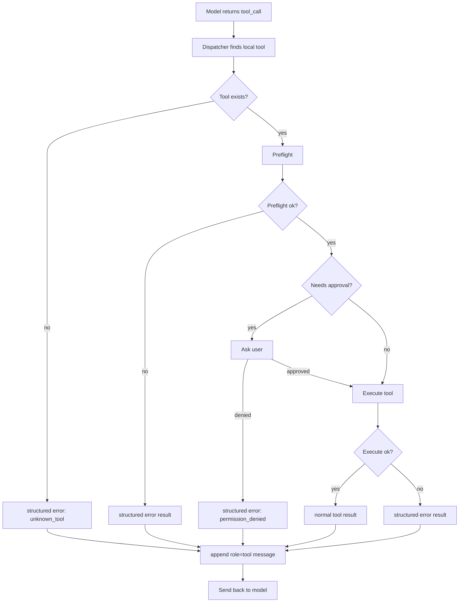

# Day 12: Tool Recovery Layer

Day 12 upgrades MiniAgent's tool layer from "tools can run" to "tools can fail
in a way the agent can understand."

## Core Idea

Tool failures are returned as structured JSON tool messages:

```json
{
  "ok": false,
  "error_type": "not_found",
  "message": "old_text not found in file: notes.txt",
  "recoverable": true,
  "suggested_next_step": "Use read_file to inspect the file, then retry edit_file with exact old_text.",
  "details": {
    "path": "notes.txt"
  }
}
```

The model receives this as a normal `role=tool` message. That means a failed
tool call can become useful context for the next model turn.

## Data Flow



## Error Types

Current error types:

```text
validation_error
permission_denied
not_found
not_unique
path_not_allowed
command_not_allowed
script_not_allowed
timeout
execution_error
unknown_tool
unknown_error
```

## Why This Matters

Before this layer, a bad tool call often became a plain string or a loop-level
error. Now MiniAgent can feed a structured failure back to the model.

Example:

```text
edit_file fails because old_text is not found
        ↓
tool message says error_type=not_found and suggests read_file
        ↓
model can call read_file
        ↓
model retries edit_file with exact old_text, or explains why it cannot proceed
```

## Recovery Policy

The first version keeps the policy simple:

- tool errors are appended as `role=tool` messages
- the agent loop continues so the model can react
- `MaxTurns` still prevents infinite recovery loops
- logs include `error_type`, `recoverable`, and `suggested_next_step`

Future versions can add:

- repeated failure detection
- per-tool retry budgets
- plan-step failure integration
- UI display for recoverable vs unrecoverable errors

## How To Test

Create or use a session with a `notes.txt` file, then ask:

```text
/task 把 notes.txt 里不存在的 xxx 改成 yyy
```

Expected learning behavior:

```text
1. model calls edit_file
2. edit_file returns ok=false, error_type=not_found
3. model should inspect or explain instead of blindly repeating the same edit
```

Also try:

```text
运行 git push
```

Expected behavior:

```text
run_shell returns ok=false, error_type=command_not_allowed
```

Inspect logs:

```text
/logs type tool_result
```
