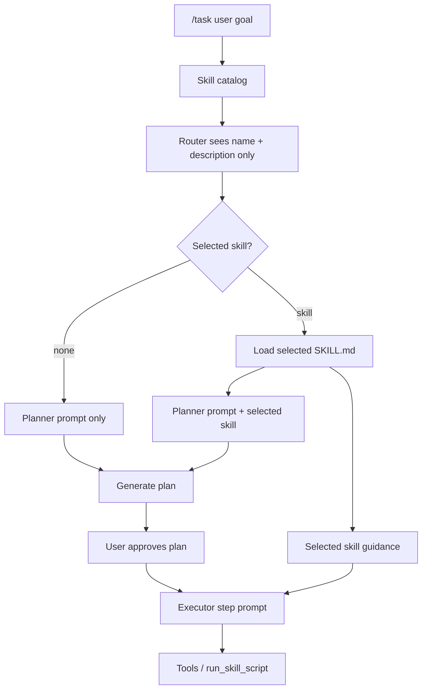

# Day 13: Skill Orchestration

Day 13 connects skills to the normal `/task` flow. Before this step, skills
could be tested with separate commands such as `/skill-route` and `/skill-load`.
Now MiniAgent can use the same idea automatically when planning and executing a
task.

## Why Route Before Loading

MiniAgent does not put every `SKILL.md` body into the model request. That would
make the prompt large and noisy.

Instead it uses progressive disclosure:

```text
Step 1: send skill catalog only
        name + description

Step 2: model selects one skill

Step 3: load only the selected SKILL.md body
```

This is both a context-saving strategy and a capability-routing strategy.

## Data Flow



## Important Boundary

Loading a skill does not execute anything.

```text
SKILL.md = instructions
manifest.local.json = local execution policy
run_skill_script = actual execution tool
approval = user-controlled boundary
```

Even when `/task` loads a skill, scripts still require:

- an allowlisted manifest entry
- a `run_skill_script` tool call
- explicit approval

## Planner Skill vs Task Skill

`skills/planner/SKILL.md` is internal planner guidance. It tells MiniAgent how
to produce a safe plan.

Task skills are domain capabilities such as `xlsx`, `pdf`, `docx`, or `demo`.
The `/task` skill router excludes `planner` so the router does not select the
internal planner skill as a user-task capability.

## Current Behavior

When `/task` starts:

```text
1. route skill from catalog
2. if selected != none, load only that skill body
3. inject selected skill into planner prompt
4. inject selected skill into each executor step prompt
5. continue using normal tools, permissions, manifests, approvals, and logs
```

Useful logs:

```text
/logs type skill_routed
/logs type task_skill_loaded
/logs type skill_route_failed
/logs type skill_load_failed
```
