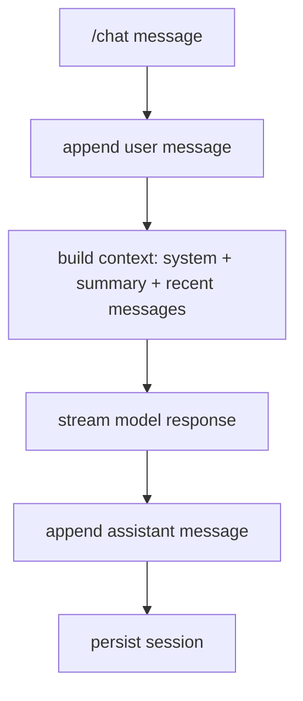
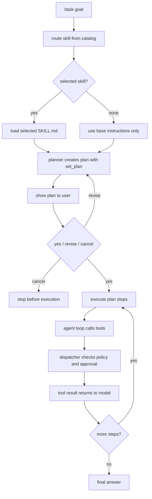
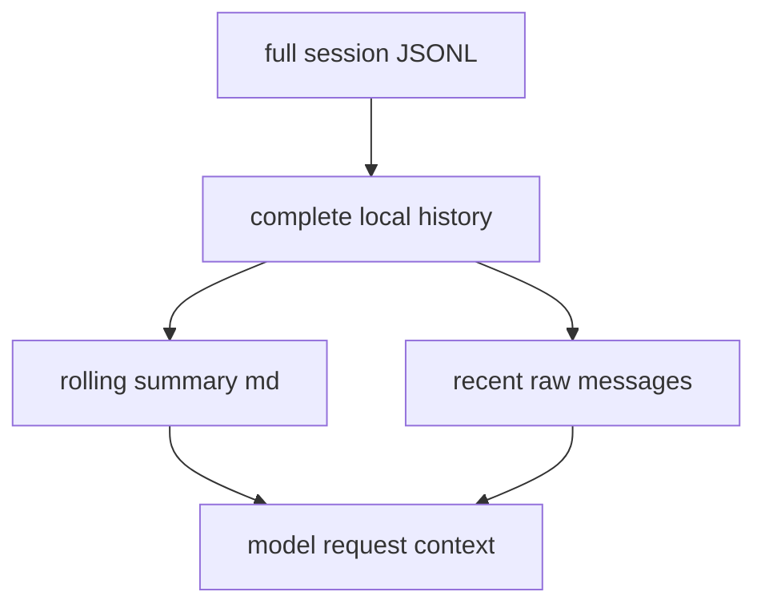
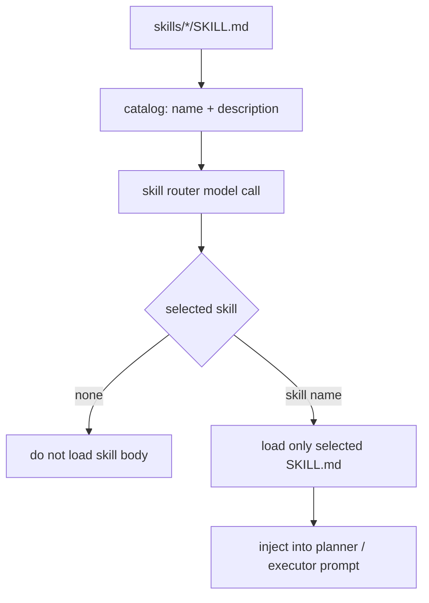
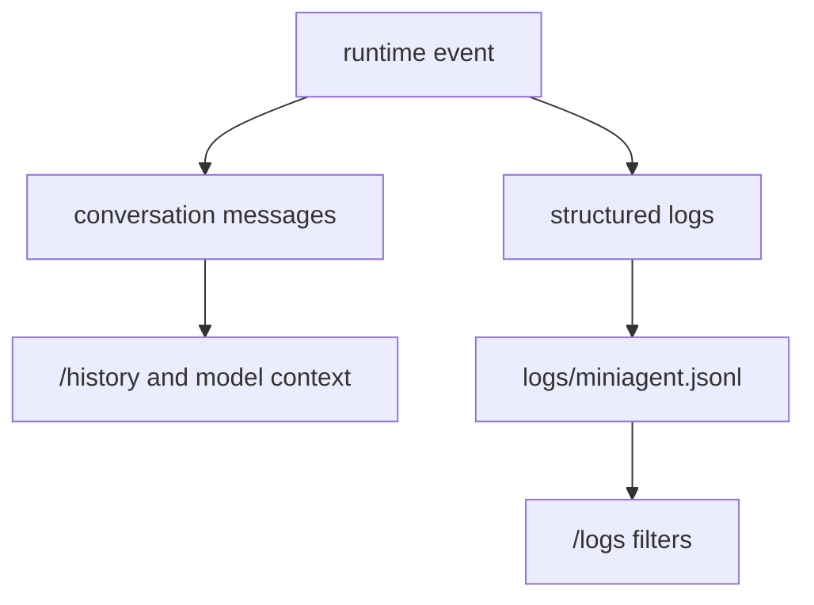
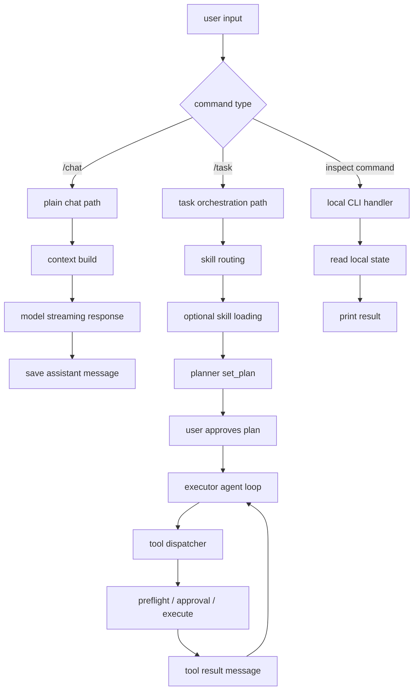
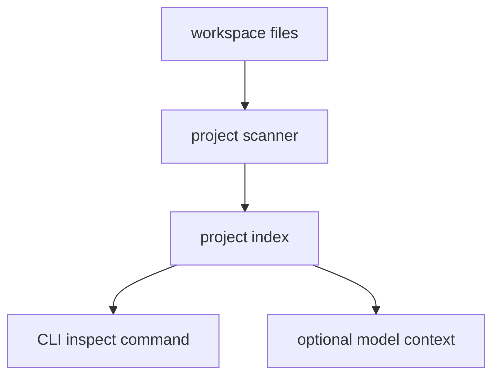
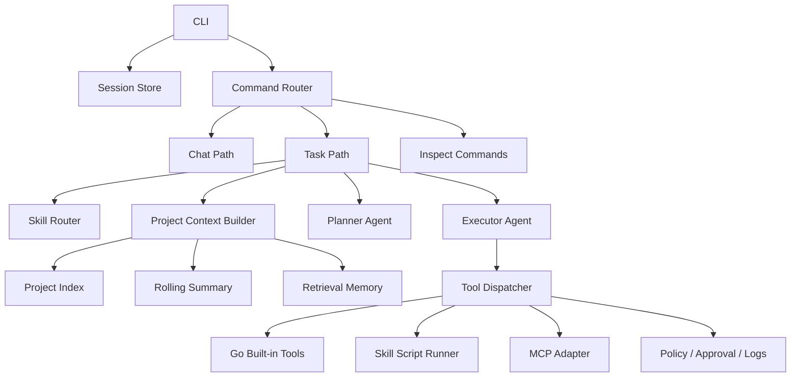

# MiniAgent V3 Plan

V3 是 MiniAgent 的新阶段：从“能跑起来的本地 agent harness”继续往
“更接近真实 coding agent 的工程原型”推进。

V1 重点是理解 messages、history、tool calling。

V2 重点是把 agent harness 的核心链路跑通：

```text
planner -> approval -> executor -> tools -> logs -> context summary -> skills
```

V3 的重点不再是继续堆命令，而是学习真实 Agent 系统里更核心的几层：

```text
project context / indexing
MCP integration
external resource permission
long-term memory / RAG
multi-agent orchestration
```

## V3 Goal

一句话目标：

```text
让 MiniAgent 从“会调用工具”升级为“能理解项目、选择能力、管理上下文、连接外部能力”的 Agent 原型。
```

V3 不追求一次性做成完整产品，而是按学习路径拆成可观察、可测试的小模块。

核心原则：

- 每一步都能通过 `/debug-api`、`/history`、`/logs` 观察数据流。
- 新能力先做最小可用版本，再考虑工程化增强。
- 所有危险能力都必须有边界：manifest、approval、allowlist、path policy、timeout、日志。
- 大模型只负责提出意图，MiniAgent 负责验证、限制、执行、记录。

## Current Command Map

当前 CLI 指令可以分成 6 类。

### 1. Plain Chat

```text
/chat <message>
```

用途：

```text
只聊天，不启用工具，普通问题走流式输出。
```

流程：



适合测试：

```text
/chat 解释一下 agent harness 是什么
```

### 2. Task Mode

```text
/task <goal>
```

用途：

```text
更接近真实 Agent：先规划，再让用户批准，然后按步骤执行。
```

当前 `/task` 已经接入 skill routing。它会先根据任务选择是否加载某个 skill，
再把选中的 skill body 注入 planner 和 executor。

流程：



适合测试：

```text
/task 读取 README.md，搜索 MiniAgent，然后运行 go test ./...
```

### 3. Plan Inspection

```text
/plan
```

用途：

```text
只查看当前 PlanState，不创建计划，也不执行计划。
```

理解重点：

```text
planner 是一个“规划用 agent 调用”。
/plan 是一个“查看 harness 内部状态”的 CLI 指令。
```

### 4. Session And Context

```text
/history
/summary
/clear
/session
/session list
/session use <id>
/session new <id>
```

用途：

```text
观察 MiniAgent 的记忆系统。
```

三层记忆：



含义：

- `/history` 看完整 session messages。
- `/summary` 看已经压缩过的长期摘要。
- 模型实际收到的是 `system + summary + recent messages`。
- 清理 session 后，模型不再拥有旧历史上下文。

适合测试：

```text
/summary
/history
/session new v3-study
/session use default
```

### 5. Skill Commands

```text
/skills
/skill <name>
/skill-route <task>
/skill-load <task>
/skill-scripts <skill>
/skill-manifest <skill>
```

用途：

```text
学习 skill 的渐进式加载过程。
```

Skill 数据流：



几个命令的区别：

```text
/skills
  只列出本地有哪些 skills。

/skill <name>
  查看某一个 skill 的元信息和 prompt 预览。

/skill-route <task>
  只发送 name + description 给模型，让模型选一个 skill。
  不加载全文，不执行脚本。

/skill-load <task>
  先 route，再加载选中的 SKILL.md 全文。
  这是 dry-run，不暴露执行工具。

/skill-scripts <skill>
  只列出 scripts/ 目录下有哪些脚本。

/skill-manifest <skill>
  查看本地 manifest.local.json 中允许或拒绝哪些脚本。
```

适合测试：

```text
/skill-route 帮我整理一个 xlsx 表格
/skill-load 帮我整理一个 xlsx 表格
/skill-manifest demo
/skill-scripts demo
```

### 6. Debug And Logs

```text
/debug-api
/logs
```

用途：

```text
观察模型请求、工具调用、审批、错误恢复、skill script preflight。
```

调试数据分流：



理解重点：

- `/history` 是对话上下文，会影响模型。
- `/logs` 是本地审计和调试记录，默认不塞回模型。
- `/debug-api` 是临时观察开关，用来看请求体和响应体。

适合测试：

```text
/debug-api
/logs type tool_result
/logs type skill_script_preflight
/logs errors
```

## Current Runtime Flow

当前 MiniAgent 最完整的运行链路如下：



## V3 Development Plan

### Day 1: Project Context Index

核心问题：

```text
模型如何在没有反复 grep/read_file 的情况下，先获得项目的大地图？
```

目标：

- 扫描项目目录，生成一个小型 project map。
- 记录 Go packages、入口文件、docs、skills、最近变动文件。
- 新增 `/project` 或 `/index` 指令查看项目索引。
- 在 `/task` 中可选注入精简项目地图。

数据流：



### Day 2: Project-Aware Task Context

核心问题：

```text
什么时候应该把 project index 发给模型？
发多少？
发给 planner 还是 executor？
```

目标：

- 给 planner 注入精简 project index。
- 给 executor 注入和任务相关的局部 project context。
- 保持上下文可控，不把全项目文件内容直接塞给模型。

### Day 3: MCP First Look

核心问题：

```text
MCP 和 function calling / tools / skills 的关系是什么？
```

目标：

- 先写 MCP 学习文档。
- 对比三类能力来源：

```text
Go built-in tool
local skill script
external MCP tool
```

- 设计 MiniAgent 的 MCP adapter 接口，先不急着接复杂 server。

### Day 4: Minimal MCP Adapter

核心问题：

```text
MiniAgent 如何发现外部 MCP 工具，并把它们转成模型可见的 tool schema？
```

目标：

- 设计 `internal/mcpbridge` 或类似包。
- 先做 mock MCP server 或本地 fake adapter。
- 观察 MCP tool schema 如何进入 request body。

### Day 5: External Resource Permission

核心问题：

```text
如果用户想让 agent 访问 workspace 外文件，权限边界怎么设计？
```

目标：

- 设计外部路径授权模型。
- 区分 workspace file、approved external file、denied path。
- 先做只读授权，再考虑写入。

### Day 6: Long-Term Memory / RAG Design

核心问题：

```text
滚动摘要解决的是会话上下文，RAG 解决的是可检索知识。
这两者怎么分工？
```

目标：

- 设计 memory store 的最小接口。
- 先用关键词/文件索引实现轻量检索。
- 后续再考虑 embedding/vector db。

### Day 7: Minimal Retrieval Tool

核心问题：

```text
模型什么时候应该检索？检索结果如何进入上下文？
```

目标：

- 新增一个最小 `search_project_context` 工具。
- 从 project index/docs/summary 中检索相关片段。
- 返回结构化结果给模型。

### Day 8: Multi-Agent Orchestration

核心问题：

```text
planner、executor、reviewer、summarizer 是不是可以看成不同 agent？
```

目标：

- 明确 agent role 的边界。
- 先用同一个模型、不同 system prompt 模拟多个 agent。
- 加入 reviewer/checker 作为执行后的轻量验证层。

### Day 9: V3 Consolidation

目标：

- 更新 README。
- 写 V3 全流程文档。
- 补核心测试。
- 提交 V3 学习阶段成果。

## V3 Architecture Target

V3 结束时，MiniAgent 希望形成这样的结构：



## What To Keep In Mind

V3 学习时可以一直抓住一个核心判断：

```text
这条信息是给模型看的，还是给 harness 自己控制流程用的？
```

例如：

- messages 是给模型看的上下文。
- logs 是给人和 harness 调试审计看的。
- manifest 是 harness 的执行策略，不是模型说了算。
- skill catalog 是给模型选择能力用的。
- skill body 只有选中后才给模型看。
- project index 可以给模型看，但必须压缩和筛选。
- MCP tools 可以暴露给模型，但执行仍由 MiniAgent 控制。

这就是 Agent Harness 的核心价值：

```text
让模型参与决策，但不把系统控制权直接交给模型。
```
